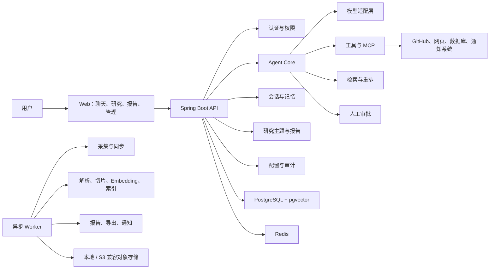

# AGENT 项目与进度

> 本文档是项目的长期“单一事实来源”（Living Document），用于记录产品定位、需求范围、技术决策、实施进度、验证结果、风险和后续计划。
> 后续每次开发、评审、方向调整和阶段验收，都应同步更新本文档。

| 项目项 | 当前内容 |
|---|---|
| 项目工作名 | InsightOps Agent（暂定） |
| 中文定位 | 行业情报、经营数据分析与业务执行 Agent |
| 首发场景 | AI / 开源软件行业情报 Agent |
| 长期方向 | 企业经营数据分析与人工确认后的任务执行 |
| 当前阶段 | 规划与新项目准备阶段 |
| 文档版本 | v0.1 |
| 创建日期 | 2026-07-31 |
| 最后更新 | 2026-07-31 |
| 下一评审点 | 完成项目名称、首发用户和数据源确认后 |

---

## 0. 文档使用规则

### 0.1 状态标记

- `[x]`：已完成并有验证证据。
- `[ ]`：尚未开始或尚未完成。
- `进行中`：当前正在实施。
- `阻塞`：存在必须先解决的问题。
- `待验证`：代码或功能已完成，但尚未通过对应测试或验收。
- `已取消`：明确不再实施，需要在决策记录中说明原因。

### 0.2 更新要求

每次推进项目时，至少更新以下内容：

1. “当前进度总览”中的阶段状态。
2. 对应需求或任务的复选框。
3. 实际完成的文件、接口或功能。
4. 执行的测试和验证结果。
5. 新发现的问题、风险与阻塞。
6. 发生变化的架构或产品决策。
7. 文档末尾的更新日志。

### 0.3 进度判断原则

- 只有写完代码并通过对应验收，才能标记为完成。
- 仅创建接口、实体或空实现，不算功能完成。
- 页面能打开但没有真实数据链路，不算业务闭环。
- 使用 Mock 数据完成演示时，必须标记为“演示可用”，不能标记为“生产可用”。
- 生产完成度必须同时考虑功能、权限、数据一致性、测试、观测、部署和恢复。

---

## 1. 项目结论与当前决策

### 1.1 核心结论

本项目不再定位为通用聊天机器人、通用知识库或通用 Agent 搭建平台，而是定位为：

> 面向运营、产品、市场、销售和行业研究人员，连接公开信息、企业文档、Excel 与数据库，自动完成信息采集、指标分析、异常解释、报告生成，并在人工确认后执行后续任务的业务 Agent。

### 1.2 产品演进路线

```text
第一阶段：AI / 开源软件行业情报 Agent
    ↓
第二阶段：行业研究 + Excel / CSV 数据分析
    ↓
第三阶段：企业数据库只读分析 + 指标语义层
    ↓
第四阶段：人工审批后的任务、通知和业务动作
    ↓
长期目标：垂直行业的经营数据分析与执行 Agent
```

### 1.3 为什么选择该方向

- 市场价值来自真实工作结果，而不是聊天能力本身。
- 研究、数据分析和内部工作流是当前 Agent 的主要落地方向。
- 现有项目经验已经覆盖 ReAct、工具调用、RAG、会话、同步任务、管理后台和导出。
- 行业情报首发版可以使用公开数据，便于独立完成和公开展示。
- 后续可以平滑加入 Excel、数据库、指标、图表、报告和业务动作。
- 不需要与 Dify、Coze 等通用 Agent 平台正面竞争。

---

## 2. 市场分析基线

> 市场信息基线日期：2026-07-31。
> 厂商报告和社区调查用于判断方向，不作为精确市场份额。

### 2.1 当前市场信号

1. Agent 正在从“回答问题”转向“完成多步骤任务和业务流程”。
2. 客服、研究与数据分析、内部流程自动化是主要落地场景。
3. 通用 Prompt、RAG、工作流、插件和模型管理已经成为标准底座。
4. 模型工具调用、文件搜索、联网搜索和执行追踪正在逐步平台化。
5. 企业真正困难的部分转向质量、延迟、评测、可观测、安全与成本。
6. MCP 正在成为 Agent 连接数据源、工具和应用的重要开放接口。
7. 通用数据分析 Agent 已有大厂产品验证，新的产品必须具备行业语义或工作流差异。

### 2.2 不建议作为主产品的方向

| 方向 | 不作为主方向的原因 |
|---|---|
| 通用知识库问答 | 功能容易被现有平台替代，差异化不足 |
| 通用 Agent 开发平台 | Dify、Coze 等已经具备完整底座，个人项目难形成竞争优势 |
| 通用客服 | 市场需求高，但成熟厂商多，需要渠道和行业数据才能形成优势 |
| 编程 Agent | 市场大，但头部模型厂商和 IDE 产品竞争极强，现有经验匹配度较低 |
| 多 Agent 群聊平台 | 演示效果强，但真实价值、可靠性和可维护性不明确 |
| 纯个人助理 | 易实现，但付费价值和产品边界通常较弱 |

### 2.3 推荐方向评分

| 方向 | 市场需求 | 现有经验匹配 | 数据可获得性 | 差异化空间 | 综合判断 |
|---|---:|---:|---:|---:|---|
| 行业情报 / 研究 Agent | 高 | 很高 | 高 | 较高 | 适合作为首发产品 |
| 企业经营数据 Agent | 高 | 最高 | 中 | 高 | 适合作为长期主产品 |
| 数据分析 + 业务执行 Agent | 高 | 最高 | 中 | 最高 | 最终推荐方向 |

### 2.4 市场资料

- [LangChain：State of Agent Engineering](https://www.langchain.com/state-of-agent-engineering)
- [Microsoft：2025 Work Trend Index](https://www.microsoft.com/en-us/worklab/work-trend-index/2025-the-year-the-frontier-firm-is-born)
- [OpenAI：New tools for building agents](https://openai.com/index/new-tools-for-building-agents/)
- [Dify 官方仓库](https://github.com/langgenius/dify)
- [Coze Studio 官方仓库](https://github.com/coze-dev/coze-studio)
- [MCP 官方介绍](https://modelcontextprotocol.io/docs/getting-started/intro)
- [Alibaba Cloud Data Agent](https://www.alibabacloud.com/help/en/dms/data-agent-version-introduction)

---

## 3. 产品定位

### 3.1 产品愿景

让用户只描述研究目标或经营问题，Agent 就能在受控范围内完成数据查找、证据整理、指标计算、原因分析、报告生成和后续任务编排。

### 3.2 核心价值

- 把分散的信息和数据统一到一个研究工作区。
- 减少人工搜索、复制、整理 Excel 和撰写重复报告的时间。
- 每条关键结论都能追溯到原始网页、文档、文件或 SQL。
- 将一次性分析沉淀为可以定时重复运行的任务。
- 将“建议”逐步扩展为经人工确认后可执行的动作。

### 3.3 首发目标用户

1. 需要长期跟踪技术和产品动态的开发者、产品经理和技术负责人。
2. 需要收集竞品、行业和政策信息的研究或市场人员。
3. 需要定期生成日报、周报和专题报告的小团队。
4. 后续扩展：需要分析销售、订单、客户和库存的运营人员。

### 3.4 首发场景

首发场景暂定为“AI / 开源软件行业情报 Agent”，支持：

- 跟踪指定项目的官方文档、博客、GitHub Release 和 Issue。
- 自动发现版本更新、功能变化、安全信息和重要事件。
- 对多个项目进行时间线和功能对比。
- 针对指定主题生成带来源引用的专题研究。
- 定时生成日报、周报和版本更新摘要。
- 保存研究过程、证据、结论和后续关注事项。

### 3.5 长期场景

- 连接 Excel、CSV、MySQL 和 PostgreSQL。
- 分析销售、订单、客户、库存等经营数据。
- 维护业务指标定义和计算口径。
- 定位异常变化及可能原因。
- 生成图表、Excel、PDF 和管理层摘要。
- 经用户确认后创建任务、发送通知或调用业务接口。

---

## 4. 用户角色与核心用户故事

### 4.1 个人研究用户

- 我希望创建一个研究主题，并指定需要持续跟踪的信息源。
- 我希望询问最近发生的变化，并看到每条结论的来源。
- 我希望比较多个项目在指定时间范围内的功能变化。
- 我希望把一次研究保存为可重复执行的模板。
- 我希望每天或每周自动收到新的情报摘要。

### 4.2 数据分析用户

- 我希望上传 Excel 或连接只读数据库后直接询问经营问题。
- 我希望 Agent 使用统一指标定义，而不是随意解释字段。
- 我希望看到 Agent 实际执行的查询和数据范围。
- 我希望每个图表和数字都能回溯到原始数据。
- 我希望将分析结果导出为 Excel 或 PDF。

### 4.3 管理员

- 我希望管理模型、Prompt、工具、数据源和知识库。
- 我希望控制用户能够访问的数据源和工具。
- 我希望查看每次 Agent 运行的步骤、耗时、成本和异常。
- 我希望维护评测用例，并在 Prompt 或模型变更后运行回归测试。
- 我希望暂停失败任务、重新执行和查看重试记录。

### 4.4 审批用户

- 我希望在 Agent 发送通知、创建任务或修改外部系统前进行确认。
- 我希望看到动作参数、影响范围和数据来源。
- 我希望拒绝、修改或批准 Agent 提出的动作。
- 我希望所有审批和执行结果都被审计。

---

## 5. 产品范围

### 5.1 首发 Alpha 必须完成

- [ ] 用户登录和基础工作区。
- [ ] 多模型适配和流式聊天。
- [ ] 会话、消息和 Agent 运行记录。
- [ ] URL、RSS、Markdown、PDF 等数据源。
- [ ] 完整知识入库：获取、解析、清洗、切片、向量化、索引。
- [ ] 文档更新、删除、重试和重新索引。
- [ ] 混合检索、重排和来源引用。
- [ ] GitHub 项目与 Release 信息采集。
- [ ] 研究主题、关注项目和关键词管理。
- [ ] 事件去重、分类和时间线。
- [ ] 日报、周报和专题报告。
- [ ] 定时任务及失败重试。
- [ ] Prompt、数据源、任务和日志管理页面。
- [ ] 基础评测集和回归评测。
- [ ] Docker Compose 本地部署。

### 5.2 Beta 增强范围

- [ ] Excel、CSV 数据导入。
- [ ] MySQL、PostgreSQL 只读数据源。
- [ ] 数据字典、字段说明和指标语义层。
- [ ] 安全查询计划与受控 SQL 执行。
- [ ] 表格、趋势图、对比图和异常标记。
- [ ] Excel、PDF 报告导出。
- [ ] 邮件、Webhook 或消息通知。
- [ ] 人工确认后的外部动作。
- [ ] MCP Server 和 MCP Client 能力。
- [ ] 团队工作区、角色和数据源权限。

### 5.3 v1.0 生产化范围

- [ ] 完整的权限、租户和数据隔离。
- [ ] Agent 输入、输出和工具 Guardrail。
- [ ] 工具超时、重试、熔断、幂等和补偿。
- [ ] 模型路由、降级、成本预算和限流。
- [ ] 全链路 Trace、指标、日志和告警。
- [ ] 数据库迁移、备份和恢复演练。
- [ ] 单元、集成、契约和端到端测试。
- [ ] CI 中强制执行测试和质量检查。
- [ ] 安全检查、依赖扫描和密钥扫描。
- [ ] 正式部署、运维和故障处理文档。

### 5.4 当前明确不做

- 第一版不做多 Agent 群聊和复杂角色社会模拟。
- 第一版不做拖拽式工作流编辑器。
- 第一版不做插件市场。
- 第一版不同时支持多个垂直行业。
- 第一版不训练或微调自有大模型。
- 第一版不拆分十几个微服务。
- 不允许 Agent 直接执行不受控的写 SQL。
- 不以单纯“上传文档后问答”作为项目完成标准。
- 不以 UI 页面数量代替真实业务闭环。

---

## 6. 目标业务流程

### 6.1 行业情报流程

```text
创建研究主题
→ 配置网站、RSS、GitHub 和文档来源
→ 定时采集
→ 内容解析和规范化
→ 去重、分类、实体与事件提取
→ 文档切片、Embedding 和索引
→ Agent 检索与交叉验证
→ 生成结论、引用和时间线
→ 生成日报、周报或专题报告
→ 保存报告并发送通知
```

### 6.2 经营数据分析流程

```text
上传 Excel / 连接只读数据库
→ 识别表结构和字段
→ 绑定业务指标定义
→ 用户提出经营问题
→ Agent 制定查询计划
→ 权限和 SQL 安全检查
→ 执行查询和指标计算
→ 生成图表、解释和数据来源
→ 导出报告
→ 用户确认后创建后续任务
```

### 6.3 业务动作流程

```text
Agent 提出动作
→ 展示动作类型、参数、影响和依据
→ 用户批准 / 修改 / 拒绝
→ 幂等执行
→ 记录结果
→ 失败重试或人工处理
→ 写入完整审计日志
```

---

## 7. 架构原则

1. 第一版采用模块化单体，不为了展示架构而拆服务。
2. Agent 推理和确定性工作流分离。
3. 模型、存储、搜索、数据源和通知均通过适配器接入。
4. PostgreSQL 作为主要事实数据库。
5. 文档入库和报告生成通过异步任务执行。
6. 所有写操作默认需要人工确认。
7. 所有答案、数字和动作都必须具备来源或执行证据。
8. 优先实现单 Agent + 工具，不提前引入多 Agent。
9. 工具接口兼容 MCP，但业务核心不绑定单一模型厂商。
10. 先建立评测集，再持续优化 Prompt、检索和模型。

---

## 8. 目标系统架构



### 8.1 推荐项目结构

```text
insightops-agent/
├─ apps/
│  ├─ server/                 # Spring Boot 主应用
│  ├─ worker/                 # 异步采集、入库、报告任务
│  └─ web/                    # Vue 管理端和聊天端
├─ modules/
│  ├─ foundation/             # 错误、响应、Trace、通用约束
│  ├─ identity/               # 用户、角色、工作区、权限
│  ├─ model/                  # Chat、Stream、Embedding、Rerank
│  ├─ agent/                  # Agent Run、Step、状态机、Guardrail
│  ├─ conversation/           # 会话、消息、摘要、记忆
│  ├─ knowledge/              # 数据源、文档、切片、向量、检索
│  ├─ research/               # 主题、事件、时间线、报告
│  ├─ analytics/              # Excel、数据库、指标、SQL、图表
│  ├─ tool/                   # 工具目录、执行、MCP、审批
│  ├─ job/                    # 定时任务、重试、补偿、导出
│  └─ audit/                  # 模型、检索、工具和审批审计
├─ infra/
│  ├─ docker/
│  ├─ migrations/
│  └─ observability/
├─ docs/
│  ├─ product/
│  ├─ architecture/
│  ├─ api/
│  └─ operations/
└─ AGENT项目与进度.md
```

---

## 9. 模块需求清单

### 9.1 账号、工作区和权限

- [ ] `AUTH-001` 支持用户注册或管理员创建用户。
- [ ] `AUTH-002` 支持登录、退出和 Token 刷新。
- [ ] `AUTH-003` 支持个人工作区和团队工作区。
- [ ] `AUTH-004` 支持管理员、研究员、分析员、审批人角色。
- [ ] `AUTH-005` 数据源、知识库和工具按工作区隔离。
- [ ] `AUTH-006` 数据库数据源支持表级和字段级授权。
- [ ] `AUTH-007` 所有管理和执行接口都有后端权限校验。

### 9.2 模型能力

- [ ] `MODEL-001` 定义统一的 Chat、Stream、Embedding、Rerank 接口。
- [ ] `MODEL-002` 至少支持一个 OpenAI-compatible 模型服务。
- [ ] `MODEL-003` 支持模型超时、重试和错误分类。
- [ ] `MODEL-004` 支持模型调用 Token、耗时和成本记录。
- [ ] `MODEL-005` 支持按任务选择聊天、Embedding 和 Rerank 模型。
- [ ] `MODEL-006` 支持模型不可用时的降级策略。
- [ ] `MODEL-007` 模型密钥加密保存，不写入代码仓库。

### 9.3 会话与记忆

- [ ] `CONV-001` 创建、重命名、关闭和删除会话。
- [ ] `CONV-002` 保存用户、助手、工具和系统消息。
- [ ] `CONV-003` 支持 SSE 断线、停止生成和重新生成。
- [ ] `CONV-004` 支持最近消息窗口和长期摘要。
- [ ] `CONV-005` 会话关联工作区、研究主题和 Agent Run。
- [ ] `CONV-006` 删除会话时同步处理关联缓存和索引。

### 9.4 数据源与知识入库

- [ ] `KB-001` 支持本地文件、URL、RSS、GitHub 数据源。
- [ ] `KB-002` 支持 Markdown、HTML、PDF、Word 和纯文本解析。
- [ ] `KB-003` 保存原始文件、规范化文本和解析元数据。
- [ ] `KB-004` 支持可配置的清洗和切片策略。
- [ ] `KB-005` 批量生成 Embedding 并写入 pgvector。
- [ ] `KB-006` 支持关键词和向量混合检索。
- [ ] `KB-007` 支持 Rerank、去重和相邻切片合并。
- [ ] `KB-008` 支持文档版本、增量更新和内容哈希。
- [ ] `KB-009` 删除文档时删除对应切片和向量。
- [ ] `KB-010` 失败任务支持重试、取消和重新索引。
- [ ] `KB-011` 每个引用能够定位到原文、URL、页码或代码位置。

### 9.5 行业情报研究

- [ ] `RES-001` 创建研究主题、关键词和关注对象。
- [ ] `RES-002` 配置采集频率和信息源。
- [ ] `RES-003` 识别项目、公司、产品、版本、人物和日期。
- [ ] `RES-004` 从内容中提取结构化事件。
- [ ] `RES-005` 基于 URL、内容哈希和语义相似度去重。
- [ ] `RES-006` 生成事件时间线。
- [ ] `RES-007` 支持多项目功能、版本和趋势比较。
- [ ] `RES-008` 生成日报、周报和专题报告。
- [ ] `RES-009` 报告中的关键事实必须带来源。
- [ ] `RES-010` 用户可以修正分类、事件和结论。

### 9.6 Excel 与数据库分析

- [ ] `DATA-001` 支持 CSV、Excel 上传和预览。
- [ ] `DATA-002` 支持 MySQL、PostgreSQL 只读连接。
- [ ] `DATA-003` 自动读取表、字段、类型和注释。
- [ ] `DATA-004` 管理字段别名、业务说明和敏感级别。
- [ ] `DATA-005` 管理指标名称、口径、维度和计算表达式。
- [ ] `DATA-006` Agent 先生成查询计划，再生成 SQL。
- [ ] `DATA-007` SQL 仅允许白名单中的只读语句。
- [ ] `DATA-008` 限制查询表、字段、行数、耗时和扫描范围。
- [ ] `DATA-009` 查询结果保存 SQL、参数、数据源和执行时间。
- [ ] `DATA-010` 支持趋势、同比、环比、排名、分布和异常分析。
- [ ] `DATA-011` 支持表格、折线、柱状、饼图等基础展示。
- [ ] `DATA-012` 每个数字和图表能够回溯到查询证据。

### 9.7 Agent 与工具执行

- [ ] `AGENT-001` 创建 Agent Run 和唯一 TraceId。
- [ ] `AGENT-002` 记录计划、思考阶段、工具调用和最终结果。
- [ ] `AGENT-003` 工具使用 JSON Schema 定义参数。
- [ ] `AGENT-004` 工具执行前进行参数和权限校验。
- [ ] `AGENT-005` 支持工具超时、重试、熔断和取消。
- [ ] `AGENT-006` 工具调用具备幂等键。
- [ ] `AGENT-007` 限制单次 Run 的步骤、时间和模型预算。
- [ ] `AGENT-008` 输入和输出使用一致的 Guardrail。
- [ ] `AGENT-009` 高风险或写操作进入人工审批。
- [ ] `AGENT-010` Agent 失败时返回可理解的原因和恢复建议。

### 9.8 MCP 与外部连接器

- [ ] `MCP-001` 内部工具模型能够映射为 MCP Tool。
- [ ] `MCP-002` 支持连接可信的远程 MCP Server。
- [ ] `MCP-003` 保存 MCP Server、工具白名单和认证配置。
- [ ] `MCP-004` 对外部工具结果执行大小、类型和安全校验。
- [ ] `MCP-005` MCP 调用写入统一 Agent 审计链路。
- [ ] `MCP-006` 不可信 MCP Server 默认禁止访问敏感数据和密钥。

### 9.9 报告、导出与通知

- [ ] `REPORT-001` 支持 Markdown 和 HTML 报告。
- [ ] `REPORT-002` 支持报告模板和章节配置。
- [ ] `REPORT-003` 支持图表和来源列表。
- [ ] `REPORT-004` 支持 Excel 和 PDF 导出。
- [ ] `REPORT-005` 大文件导出使用异步任务。
- [ ] `REPORT-006` 导出任务支持进度、失败和重新执行。
- [ ] `REPORT-007` 支持邮件或 Webhook 通知。
- [ ] `REPORT-008` 下载链接具备权限和有效期。

### 9.10 定时任务

- [ ] `JOB-001` 支持按时间创建采集和报告任务。
- [ ] `JOB-002` 任务记录开始、结束、进度和心跳。
- [ ] `JOB-003` 服务重启后恢复未完成任务。
- [ ] `JOB-004` 同一业务任务避免重复执行。
- [ ] `JOB-005` 支持暂停、取消、重试和手动触发。
- [ ] `JOB-006` 达到最大重试次数后进入人工处理队列。

### 9.11 管理后台

- [ ] `ADMIN-001` 模型供应商与模型配置。
- [ ] `ADMIN-002` Prompt 模板、版本、发布和回滚。
- [ ] `ADMIN-003` 数据源和知识库管理。
- [ ] `ADMIN-004` 工具、MCP Server 和权限管理。
- [ ] `ADMIN-005` 研究主题、采集规则和任务管理。
- [ ] `ADMIN-006` Agent Run、模型、检索和工具日志。
- [ ] `ADMIN-007` 失败任务、重试和告警管理。
- [ ] `ADMIN-008` 评测数据集和评测结果管理。

### 9.12 评测与可观测

- [ ] `EVAL-001` 建立不少于 50 条首发场景评测问题。
- [ ] `EVAL-002` 保存预期来源、关键事实和预期工具。
- [ ] `EVAL-003` 评测答案正确性、来源支持度和完整性。
- [ ] `EVAL-004` 评测检索 Recall@K 和引用命中率。
- [ ] `EVAL-005` 评测工具选择、参数和执行结果。
- [ ] `EVAL-006` Prompt、模型或检索策略变更后自动回归。
- [ ] `OBS-001` 记录 Agent Run 全链路 Trace。
- [ ] `OBS-002` 记录请求量、失败率、延迟和 Token 成本。
- [ ] `OBS-003` 记录采集、入库、导出和通知任务指标。
- [ ] `OBS-004` 对连续失败、积压和成本异常触发告警。

---

## 10. 非功能需求

### 10.1 安全

- [ ] 仓库中不存在明文密钥、Token 和生产密码。
- [ ] 数据库连接默认只读。
- [ ] SQL、URL、文件路径和工具参数进行严格校验。
- [ ] 防止 SSRF、任意文件读取、路径穿越和命令注入。
- [ ] 模型输出按不可信输入处理，不能直接成为系统命令。
- [ ] 外部内容中的 Prompt Injection 不得绕过权限和审批。
- [ ] 敏感字段不发送给未授权模型供应商。
- [ ] 所有高风险动作均有用户确认和审计。

### 10.2 可靠性

- [ ] 关键写入使用事务或 Outbox 保证一致性。
- [ ] 异步任务具备幂等、重试、补偿和死信处理。
- [ ] 文档删除不会残留可检索向量。
- [ ] 客户端断开后能够停止无意义的模型生成。
- [ ] 外部模型、网站或工具不可用时提供明确降级结果。

### 10.3 性能与成本

- [ ] SSE 首 Token 延迟建立基线并持续监控。
- [ ] 控制单次 Agent 的最大轮数、Token 和工具调用次数。
- [ ] Embedding、解析和索引支持批处理。
- [ ] 对重复内容、查询和报告进行合理缓存。
- [ ] 保存每次任务的模型成本并支持工作区预算。
- [ ] 大结果不直接完整塞入模型上下文。

### 10.4 可维护性

- [ ] 模块职责明确，不建立只做一行转发的空层。
- [ ] 业务逻辑不放在 Controller。
- [ ] 核心领域不依赖具体模型或向量数据库 SDK。
- [ ] 数据库使用版本化迁移。
- [ ] 所有公共接口具备契约测试。
- [ ] 架构决策通过 ADR 记录。

### 10.5 部署与恢复

- [ ] 一条命令启动本地开发依赖。
- [ ] 开发、测试、生产配置分离。
- [ ] CI 自动编译、测试、构建镜像和扫描依赖。
- [ ] 数据库、对象存储和配置具备备份策略。
- [ ] 至少完成一次恢复演练。
- [ ] 提供部署、升级、回滚和故障排查文档。

---

## 11. 初步技术选型

> 精确版本在创建新项目时锁定，并记录到 ADR。当前只确定技术方向。

| 能力 | 初步选择 | 说明 |
|---|---|---|
| 后端 | Java 21 + Spring Boot | 延续已有技术优势 |
| 前端 | Vue 3 + TypeScript + Vite | 聊天端与管理端合并维护 |
| 主数据库 | PostgreSQL | 业务数据、任务、日志统一存储 |
| 向量检索 | pgvector | 第一版降低部署复杂度 |
| 缓存 | Redis | 会话热点、锁、限流和短期缓存 |
| 对象存储 | 本地文件 + S3 兼容接口 | 本地开发不依赖云服务 |
| 数据访问 | MyBatis / JPA 二选一 | 在创建骨架前通过 ADR 确定 |
| 文档解析 | Apache Tika、PDFBox、POI 等 | 按文件类型建立独立解析器 |
| 模型协议 | OpenAI-compatible + 自定义适配器 | 不绑定单一供应商 |
| 流式协议 | SSE | 首版无需 WebSocket |
| 工具协议 | 内部 Tool SPI + MCP 映射 | 保留内部控制并支持开放生态 |
| 后台任务 | 数据库任务表 + Worker | 第一版不强制引入 Kafka |
| 调度 | Spring Scheduler / Quartz | 根据任务持久化要求决定 |
| 图表 | ECharts | 支持报告和数据分析展示 |
| 后端测试 | JUnit 5、Testcontainers、WireMock | 覆盖数据库和外部服务 |
| 前端测试 | Vitest、Playwright | 组件和端到端测试 |
| 可观测 | Micrometer / OpenTelemetry | 对接 Prometheus、Grafana 等 |
| 本地部署 | Docker Compose | 提供可复现开发环境 |
| 生产部署 | Docker，后续再评估 K8s | 不提前增加运维复杂度 |

### 11.1 暂不引入

- 第一版不引入 Nacos：单体应用优先使用环境变量和配置文件。
- 第一版不引入独立 Gateway：使用反向代理和后端统一鉴权。
- 第一版不引入 Kafka：先验证数据库任务表是否满足吞吐量。
- 第一版不引入 Milvus：先验证 pgvector 的容量和延迟。
- 第一版不拆独立模型微服务：先作为清晰模块运行。

---

## 12. 开发前准备清单

### 12.1 产品准备

- [ ] 确定正式项目名称。
- [ ] 确定一句话产品定位。
- [ ] 确定首发用户画像。
- [ ] 访谈或模拟不少于 3 个目标用户的工作流程。
- [ ] 收集不少于 20 个真实研究问题。
- [ ] 确定 Alpha、Beta 和 v1.0 的范围。
- [ ] 确定项目是开源、闭源还是核心开源。

### 12.2 账号与基础设施

- [ ] 创建新的 Git 仓库。
- [ ] 确定新的 Java GroupId 和前端包名。
- [ ] 准备模型服务账号或本地模型。
- [ ] 准备独立的数据库和 Redis。
- [ ] 准备测试用邮件或 Webhook。
- [ ] 如需云部署，准备独立云账号和域名。
- [ ] 建立开发、测试、生产密钥管理方式。

### 12.3 数据准备

- [ ] 选择 10～20 个首发跟踪项目。
- [ ] 收集项目官网、文档、博客、GitHub、RSS 等来源。
- [ ] 记录每个来源的名称、URL、更新频率和可信等级。
- [ ] 准备 PDF、Markdown、HTML 等测试文档。
- [ ] 准备内容重复、更新、删除和解析失败样本。
- [ ] 准备 50～100 条评测问题。
- [ ] 为评测问题标注预期来源和关键事实。
- [ ] 为后续数据分析准备一套合成销售/订单数据。

### 12.4 开发环境

- [ ] 安装并确认 JDK 21。
- [ ] 安装 Maven。
- [ ] 安装当前受支持的 Node.js LTS。
- [ ] 安装 Docker 和 Docker Compose。
- [ ] 确认 PostgreSQL + pgvector 镜像可用。
- [ ] 准备 API 调试、数据库和日志查看工具。
- [ ] 统一代码格式、提交规范和分支策略。

### 12.5 设计准备

- [ ] 创建产品 PRD。
- [ ] 创建系统上下文图和容器图。
- [ ] 完成第一版核心实体关系图。
- [ ] 定义统一错误码和 API 响应。
- [ ] 定义 Agent Run、Step、Tool Call 状态机。
- [ ] 定义数据源、文档和索引状态机。
- [ ] 定义任务、重试、取消和恢复语义。
- [ ] 定义工具权限和审批等级。
- [ ] 定义评测指标和发布门禁。

---

## 13. 现有经验到新项目的能力映射

> 只保留已验证的产品和架构经验，新项目重新设计和实现。

| 既有经验 | 新项目模块 | 新的改进重点 |
|---|---|---|
| ReAct、Function Calling | `agent` | 单 Agent 优先、预算限制、统一 Guardrail、完整 Trace |
| 模型 SDK 与模型服务 | `model` | 合并重复实现、统一 Provider 接口、成本和降级 |
| Conversation 服务 | `conversation` | 数据库为事实源、可靠停止、摘要和长期记忆 |
| RAG 检索 | `knowledge` | 优先补齐真实 ingest、版本、删除、引用和评测 |
| CRM 动态工具 | `tool` | 领域无关工具目录、权限、审批、MCP |
| Kafka 同步与向量化 | `job` / `knowledge` | 先用可靠任务表，确保更新和删除语义完整 |
| Prompt 与意图管理 | `admin` / `agent` | Prompt 版本、发布、回滚和自动回归 |
| 会话、日志、同步管理后台 | `web` | 一个统一产品工作台，减少重复脚手架 |
| 导入导出 | `report` / `job` | 独立导出任务、进度、对象存储和有效期下载 |
| 网关和 API BFF | `server` | 第一版合并，减少部署和接口重复 |

---

## 14. 分阶段实施计划

### Phase 0：方向与项目初始化

目标：形成可以开始编码的明确范围。

- [x] 完成现有项目能力审计。
- [x] 完成市场方向分析。
- [x] 确定推荐方向：行业情报 → 数据分析 → 业务执行。
- [x] 创建本进度文档。
- [x] 确定正式名称、Logo 占位和一句话定位。
- [x] 确定首发跟踪项目和信息源。
- [x] 创建新仓库及基础目录。
- [x] 完成产品范围、架构 ADR 和数据模型草案。

验收标准：

- 产品目标、用户、范围、数据和技术路线没有关键歧义。
- 新仓库不依赖旧项目即可独立构建。

### Phase 1：工程底座

目标：建立可持续开发和验证的基础工程。

- [x] 创建后端、Worker 和前端项目。
- [x] 配置 PostgreSQL 和 pgvector；Redis 与对象存储按 P0 决策延期。
- [x] 建立数据库迁移。
- [x] 建立 P0 API 响应、错误分类、TraceId 和日志。
- [ ] 建立用户登录和工作区授权（移入 P1）。
- [x] 建立 CI 编译、测试和前端生产构建；容器镜像构建移入生产化阶段。
- [x] 建立 Docker Compose。
- [x] 建立 Windows 一键启动、停止和健康检查脚本。

验收标准：

- 新环境可以通过一条命令启动。
- 后端、前端和数据库健康检查正常。
- CI 实际执行测试，不跳过测试。

### Phase 2：最小 Agent 垂直闭环

目标：用户能够进行一次可追踪的流式 Agent 对话。

- [x] 实现统一模型接口。
- [x] 接入首个模型 Provider。
- [x] 实现 SSE 流式输出和取消。
- [x] 实现会话、消息和 Agent Run。
- [x] 实现首个 Agent Tool Step。
- [x] 实现受控工具路由、参数校验和首个真实工具。
- [ ] 实现输入、输出 Guardrail。
- [x] 实现基础调用日志和成本统计。

验收标准：

- 用户提问后，Agent 能调用一个真实工具并流式返回结果。
- 页面能够查看完整 Run、Step 和 Tool Call。
- 断开或停止后不继续无意义生成。

### Phase 3：完整知识库与 RAG

目标：完成从原始资料到可引用答案的完整链路。

- [ ] 实现数据源和知识库。
- [ ] 实现文件、URL、RSS 采集。
- [ ] 实现解析、清洗、切片和 Embedding。
- [ ] 实现 pgvector 索引。
- [ ] 实现关键词 + 向量混合检索。
- [ ] 实现 Rerank 和切片合并。
- [ ] 实现来源引用。
- [ ] 实现更新、删除、重建和失败重试。
- [ ] 建立第一批 RAG 评测用例。

验收标准：

- 新增、修改和删除文档后，检索结果与数据状态一致。
- 关键回答可以打开并定位到原文。
- RAG 回归评测达到首版门槛。

### Phase 4：行业情报 Alpha

目标：形成可以公开展示的完整行业情报产品。

- [ ] 实现 GitHub 项目、Release 和 Issue 采集。
- [ ] 实现研究主题和关注列表。
- [ ] 实现事件提取、分类和去重。
- [ ] 实现时间线和项目对比。
- [ ] 实现专题研究。
- [ ] 实现日报和周报。
- [ ] 实现定时采集和报告任务。
- [ ] 完成首发管理页面。

验收标准：

- 可以持续跟踪不少于 10 个真实项目。
- 能自动生成有来源的日报和周报。
- 连续运行 7 天无任务永久卡死或重复报告。

### Phase 5：经营数据分析 Beta

目标：从行业研究扩展到结构化经营数据。

- [ ] 实现 CSV、Excel 导入。
- [ ] 实现只读数据库连接。
- [ ] 实现字段字典和指标语义层。
- [ ] 实现查询计划和安全 SQL。
- [ ] 实现指标分析和图表。
- [ ] 实现数据来源和 SQL 追溯。
- [ ] 实现 Excel、PDF 报告。
- [ ] 建立 Text-to-SQL 和指标评测集。

验收标准：

- 预设经营问题能够稳定得到正确指标。
- 所有数字可追溯到 SQL、参数和数据源。
- 危险、越权或超范围 SQL 被阻止。

### Phase 6：业务执行与审批

目标：让 Agent 从分析走向受控执行。

- [ ] 实现动作风险等级。
- [ ] 实现审批流程。
- [ ] 实现邮件、Webhook 或任务系统工具。
- [ ] 实现动作幂等、重试和补偿。
- [ ] 实现审批与执行审计。
- [ ] 实现 MCP Server / Client。

验收标准：

- 未经批准的写操作不能执行。
- 重复提交不会造成重复业务结果。
- 每次动作都能追踪提出、审批、执行和结果。

### Phase 7：质量、安全与生产化

目标：达到可持续运行的 v1.0。

- [ ] 完善单元、集成、契约和端到端测试。
- [ ] 建立自动评测发布门禁。
- [ ] 完善权限和工作区隔离。
- [ ] 完善观测、告警和成本预算。
- [ ] 完成安全检查和威胁测试。
- [ ] 完成性能测试和容量基线。
- [ ] 完成备份、恢复和故障演练。
- [ ] 完成部署、升级和回滚文档。

验收标准：

- 核心回归和安全门禁全部通过。
- 关键故障有告警、降级和恢复方式。
- 新环境能够按照文档完成独立部署。

---

## 15. 当前进度总览

| 阶段 | 状态 | 已完成 | 下一步 |
|---|---|---|---|
| 市场和方向分析 | 已完成 | 市场趋势、方向比较、推荐场景 | 定期复核市场变化 |
| 现有能力审计 | 已完成 | 核心能力、缺口和可迁移经验 | 形成新项目模块边界 |
| 产品定义 | 进行中 | 确定 InsightOps Agent、首发用户、3 个项目、19 条官方来源和 20 问评测集 | 访谈首批用户并执行 Alpha 验收 |
| 架构设计 | P0 已完成 | ADR、模块边界、领域模型和状态机 | 随真实链路继续演进 |
| 新项目初始化 | P0 已完成 | Git 基线、四个 Maven 模块、Vue、Compose、Flyway、CI、一键启动脚本 | 配置远程仓库后验证首次远程 CI |
| Agent 核心 | P0 已完成 | DeepSeek 流式调用、会话/Run、GitHub Release 工具、Step/Tool Call 审计、成本与执行记录页面 | P1 增加登录、隔离和多轮记忆 |
| 知识库与 RAG | 未开始 | 无 | 等待 Agent 最小闭环 |
| 行业情报 Alpha | 未开始 | 无 | 等待完整 RAG |
| 数据分析 Beta | 未开始 | 无 | 等待行业情报 Alpha |
| 业务执行 | 未开始 | 无 | 等待审批模型设计 |
| 生产化 | 未开始 | 无 | 持续建设 |

### 15.1 当前阻塞项

- 正式项目名称已确定为 InsightOps Agent。
- 首发用户已确定为 Java 开发者、架构师和技术负责人，尚未进行实际访谈。
- 首批跟踪项目已确定为 Spring AI、LangChain4j 和 Dify；官网、GitHub、文档、博客/公告和 Atom 已登记，P0 数据源仍只启用 GitHub Release。
- 新项目 Git 仓库、工程骨架和 P0 技术 ADR 已创建并通过本地验证；本地 `main` 已建立首个 P0 基线提交。
- Chat Provider 已接入 DeepSeek，P0 默认 `deepseek-v4-flash`、关闭思考模式、月度开发预算基线20元；同步与流式/取消 Smoke Test 均已通过。
- 会话、USER/ASSISTANT 消息和 Agent Run 已落库；成功、取消、失败均有明确终态，并已提供分页执行记录页面。
- GitHub Release 工具链和 Run/Step/Tool Call 详情页均已通过真实验收。

---

## 16. 接下来两周的优先任务

### 第 1～3 天：锁定产品

- [x] `P0-001` 确定项目名称和一句话介绍。
- [x] `P0-002` 确定首发用户：Java 开发者、架构师和技术负责人。
- [x] `P0-003` 首批选择 Spring AI、LangChain4j 和 Dify，Alpha 验证后再扩展到 10～20 个项目。
- [x] `P0-004` 收集首批官网、GitHub、博客和 RSS，并建立可自动校验的官方来源登记表。
- [x] `P0-005` 编写 20 个真实用户问题，并建立 P0 JSONL 评测基线。

### 第 4～5 天：锁定架构

- [x] `P0-006` 创建新 Git 仓库。
- [x] `P0-007` 确定 GroupId、模块名和目录结构。
- [x] `P0-008` 编写 ADR-001：模块化单体。
- [x] `P0-009` 编写 ADR-002：PostgreSQL + pgvector。
- [x] `P0-010` 设计第一版核心实体和状态机。

### 第 6～10 天：建立工程底座

- [x] `P0-011` 创建 Spring Boot Server。
- [x] `P0-012` 创建 Worker。
- [x] `P0-013` 创建 Vue 3 + TypeScript Web。
- [x] `P0-014` 创建 Docker Compose。
- [x] `P0-015` 接入数据库迁移和健康检查。
- [x] `P0-016` 建立 CI 和首批自动测试。

### 第 11～14 天：完成第一条真实链路

- [x] `P0-017` 接入第一个模型。
- [x] `P0-018` 实现 SSE 流式聊天。
- [x] `P0-019` 保存会话和 Agent Run。
- [x] `P0-020` 实现第一个真实工具。
- [x] `P0-021` 页面展示工具调用和最终结果。
- [x] `P0-022` 为该链路补充自动测试。

两周验收目标：

> 新项目可以独立启动；用户发起问题后，Agent 调用一个真实工具，流式返回答案，并能在后台查看完整执行记录。

---

## 17. 关键风险

| 风险 | 可能性 | 影响 | 应对措施 | 当前状态 |
|---|---:|---:|---|---|
| 范围不断扩大 | 高 | 高 | Alpha 只做行业情报，其他能力进入后续阶段 | 持续关注 |
| 先做平台、没有用户场景 | 高 | 高 | 每个功能必须对应具体用户问题 | 持续关注 |
| 数据源质量不稳定 | 高 | 高 | 来源分级、去重、失败重试和人工修正 | 已完成官方来源分级与缺口登记；采集质量策略待实施 |
| RAG 有引用但结论错误 | 高 | 高 | 评测集、交叉来源、事实与观点分离 | 未实施 |
| Text-to-SQL 越权或错误 | 中 | 高 | 只读账号、语义层、AST 检查、查询限制 | 后续阶段 |
| Agent 自动执行造成副作用 | 中 | 高 | 人工审批、幂等和动作白名单 | 后续阶段 |
| 模型调用成本失控 | 中 | 中 | 预算、缓存、模型路由和上下文压缩 | 未实施 |
| 多步骤 Agent 延迟过高 | 高 | 中 | 限制步骤、并行工具、快慢模型分工 | 未实施 |
| 过早拆分微服务 | 中 | 高 | 第一版坚持模块化单体 | 已决策 |
| 测试再次落后于代码 | 高 | 高 | 每个 Phase 都有测试验收门槛 | 已纳入计划 |

---

## 18. 成功指标

### 18.1 Alpha 指标

- 能稳定跟踪不少于 10 个真实项目。
- 连续 7 天完成定时采集和报告。
- 关键事实来源覆盖率达到预设门槛。
- 用户可以从报告跳转到原始来源。
- 失败任务不存在永久“处理中”状态。
- 每个 Agent Run 都可以完整追踪。

### 18.2 Beta 指标

- 预设经营问题的指标计算通过人工标注评测。
- 生成 SQL 的权限和安全检查全部通过。
- 所有图表和数字具备数据血缘。
- 报告生成、导出和通知任务具备稳定成功率。
- Prompt 和模型变更有自动回归结果。

### 18.3 v1.0 指标

- 核心场景端到端自动测试稳定通过。
- 高风险动作全部经过审批。
- 核心服务有监控、告警和恢复流程。
- 完成数据库和文件备份恢复演练。
- 完成独立环境部署验证。
- 文档足以让新开发者完成本地启动和核心功能调试。

---

## 19. 架构决策记录

| 决策编号 | 日期 | 决策 | 状态 | 原因 |
|---|---|---|---|---|
| `D-001` | 2026-07-31 | 不做通用 Agent 平台 | 已接受 | 通用底座成熟，差异化不足 |
| `D-002` | 2026-07-31 | 首发做 AI / 开源软件行业情报 | 暂定 | 数据公开、易验证、适合独立开发 |
| `D-003` | 2026-07-31 | 长期做经营数据分析与执行 | 已接受 | 市场价值和现有经验匹配度最高 |
| `D-004` | 2026-07-31 | 第一版采用模块化单体 | 已接受 | 降低开发、部署和联调成本 |
| `D-005` | 2026-07-31 | 第一版使用 PostgreSQL + pgvector | 暂定 | 降低数据库和向量设施数量 |
| `D-006` | 2026-07-31 | 单 Agent + 工具优先 | 已接受 | 可靠性和可测试性优先于多 Agent 展示 |
| `D-007` | 2026-07-31 | 写操作必须人工确认 | 已接受 | 控制业务副作用 |
| `D-008` | 2026-07-31 | 工具层兼容 MCP | 已接受 | 提高连接器生态和长期兼容性 |
| `D-009` | 2026-07-31 | CI 不允许长期跳过测试 | 已接受 | 自动验证是生产化核心能力 |

---

## 20. 待确认事项

- [x] 正式项目名称使用 InsightOps Agent。
- [x] 首发内容确定为 AI / 开源软件情报。
- [x] 首发用户确定为 Java 开发者、架构师和技术负责人。
- [ ] 是否计划开源。
- [x] 第一模型使用 DeepSeek，P0 月度开发预算基线20元。
- [x] 数据访问层按场景使用 Spring Data JPA 与 JdbcClient，不引入 MyBatis。
- [x] P0 只使用 PostgreSQL；Redis 在出现明确会话热点、锁或限流需求后再引入。
- [ ] 报告首版是否必须支持 PDF。
- [ ] 首个通知渠道选择邮件、Webhook、钉钉还是企业微信。
- [x] Alpha 从 P1 开始支持基础登录与个人工作区，多用户复杂权限延期。

---

## 21. 每次开发更新模板

后续在更新日志中复制以下模板：

```markdown
### YYYY-MM-DD / vX.Y

#### 本次目标

-

#### 已完成

- [x]

#### 修改内容

- 新增：
- 修改：
- 删除：

#### 验证

- 命令：
- 结果：
- 未执行：

#### 问题与风险

-

#### 决策变化

-

#### 下一步

- [ ]
```

---

## 22. 更新日志

### 2026-07-31 / v0.1

#### 本次目标

- 建立新 Agent 项目的长期规划和进度跟踪文档。

#### 已完成

- [x] 汇总现有项目能力分析。
- [x] 汇总 2026 年 Agent 市场方向分析。
- [x] 确定推荐产品路线。
- [x] 定义 Alpha、Beta 和 v1.0 范围。
- [x] 定义目标架构、模块需求和非功能要求。
- [x] 创建分阶段实施计划和两周优先任务。
- [x] 建立风险、成功指标和架构决策记录。

#### 验证

- 文档结构已覆盖产品、数据、技术、任务、验收、风险和更新规则。
- 已创建 InsightOps Agent 工程代码；后端 12 个测试、前端 lint/2 个测试/生产构建均通过。
- PostgreSQL 18.4、pgvector 0.8.5、Flyway v2、11 张 P0 表和后端健康接口已完成真实启动验证。

#### 下一步

- [x] 确认项目名称和首发用户。
- [x] 确认首批跟踪项目和 P0 数据源。
- [x] 创建新项目仓库和工程骨架。
- [x] 执行 `P0-017`：在本地 `.env` 配置 DeepSeek Key，完成实际模型调用和在线 Smoke Test。
- [x] 执行 `P0-018`：实现 DeepSeek SSE 流式聊天和取消。

### 2026-08-16 / v0.2

#### 本次目标

- 完成 `P0-017` 首个模型 Provider 的真实接入。

#### 已完成

- [x] 在 Core 建立 Provider 无关的 `ChatModelGateway`、请求、响应、用量和错误契约。
- [x] 接入 DeepSeek 官方 API 与 `deepseek-v4-flash`。
- [x] 增加默认关闭、固定提示词、低 Token 上限的在线 Smoke 入口。
- [x] 记录模型、Token、耗时和 TraceId。
- [x] 将认证/请求错误、限流/服务错误和未知错误映射为统一模型错误。
- [x] 根据真实兼容性结果，从原生 DeepSeek Starter 切换到 OpenAI-compatible Starter。

#### 验证

- 官方模型列表返回 `deepseek-v4-flash` 和 `deepseek-v4-pro`。
- 在线 Smoke 精确返回 `DEEPSEEK_SMOKE_OK`；耗时 1433 ms，输入 34、输出 9、总计 43 Token。
- 后端 Maven Reactor 构建成功，12 个测试全部通过。
- `.env` 仍被 Git 忽略，真实 Key 未进入源码、响应、测试报告或日志。

#### 下一步

- [x] 执行 `P0-018`：实现 DeepSeek SSE 流式聊天和取消。

### 2026-08-16 / v0.3

#### 本次目标

- 完成 `P0-018` DeepSeek SSE 流式聊天和取消。

#### 已完成

- [x] 在 Core 建立流事件、监听器、可取消会话和流式模型端口。
- [x] DeepSeek 适配器支持增量内容、完成元数据、首 Token 计时和底层订阅取消。
- [x] 新增 SSE 开始、增量、完成、取消和错误事件，以及独立取消接口。
- [x] Vue 研究问答页接入真实流，支持增量显示、停止生成和运行指标展示。
- [x] 增加 Core、Infrastructure、Server 和前端 SSE 解析测试。

#### 验证

- Maven Reactor 构建成功，后端 20 个测试全部通过。
- 前端 lint、3 个测试和生产构建全部通过。
- 在线流式请求收到 22 个增量 Chunk；首 Token 282 ms，总耗时 662 ms，总计 116 Token。
- 在线取消在第 1 个 Chunk 后返回 200；收到 `cancelled`，取消后 0 个新增 Chunk，且没有 `completed`。
- 浏览器端到端验证了增量显示、完成状态、模型、Token、耗时、RunId 和 TraceId，控制台无 warning/error。
- `.env` 仍被 Git 忽略，真实 Key 未进入源码、响应、测试报告或日志。

#### 下一步

- [x] 执行 `P0-019`：保存会话、消息和 Agent Run。

### 2026-08-16 / v0.4

#### 本次目标

- 完成 `P0-019` 会话、消息和 Agent Run 持久化。

#### 已完成

- [x] 在 Core 增加 Provider 无关的 `ChatRunStore` 持久化端口。
- [x] 使用 JdbcClient 和事务实现会话创建/续接、消息顺序和 Run 终态保存。
- [x] 新增 V3 Flyway 迁移，建立 Alpha 默认工作区。
- [x] SSE `started` 事件返回 `sessionId`，前端在当前页面持续复用同一会话。
- [x] 成功回答保存 USER 与 ASSISTANT 消息；取消/失败保存 Run 审计和部分回答，但不生成误导性的 ASSISTANT 消息。
- [x] 页面显示会话短 ID，并明确当前问答已经保存。

#### 验证

- Flyway V1～V3 全部成功，PostgreSQL Schema 位于版本 3。
- 同一会话的成功与取消 Run 分别落为 `SUCCEEDED`、`CANCELLED`，均有完成时间。
- 消息顺序为 USER 1、ASSISTANT 2、USER 3；取消回答只保留在 Run 中。
- 浏览器生成的 Run 实际保存模型、输入/输出 Token 和 2 条会话消息，控制台无 warning/error。
- 后端 Maven Reactor 构建成功，21 个测试全部通过；前端 lint、3 个测试和生产构建全部通过。
- `.env` 仍被 Git 忽略，真实 Key 未进入源码、响应、测试报告或日志。

#### 下一步

- [x] 执行 `P0-020`：实现首个真实 GitHub Release 工具和 Agent Step/Tool Call 记录。

### 2026-08-16 / v0.5

#### 本次目标

- 完成 `P0-020` 首个真实 GitHub Release 工具链。

#### 已完成

- [x] 建立 Core GitHub Release 查询、结果、错误和工具执行存储端口。
- [x] 实现 GitHub REST Releases 适配器，发送官方推荐 Header，并限制为 Spring AI、LangChain4j、Dify 三个仓库。
- [x] 实现受控 Release 问题路由、时间窗口解析和预发布口径。
- [x] 将工具结果作为受控证据交给 DeepSeek，要求关键事实引用官方 Release URL。
- [x] 事务保存 Agent Step、Tool Call、请求/结果 JSON、耗时、状态和 Run 工具轮次。
- [x] ASSISTANT 消息保存来源引用；前端展示工具名、Release 数量和官方来源。
- [x] 新增 V4 Flyway 迁移，落地三个 P0 跟踪项目。

#### 验证

- Flyway V1～V4 全部成功，三个 P0 项目均为启用状态。
- 真实请求获取 2 条 Spring AI Release，SSE 依次收到工具开始、工具完成和模型完成。
- Run 为 `SUCCEEDED`、`tool_rounds=1`；Step 与 Tool Call 均为 `SUCCEEDED`。
- Tool Call 结果 JSON 含 2 条 Release，ASSISTANT 消息保存 2 条引用。
- 最终回答包含官方 GitHub URL；页面显示工具结果和可点击来源，控制台无 warning/error。
- 后端 Maven Reactor 构建成功，27 个测试全部通过；前端 lint、3 个测试和生产构建全部通过。
- `.env` 仍被 Git 忽略，真实 Key 未进入源码、工具结果、测试报告或日志。

#### 决策变化

- P0 工具选择采用项目控制的白名单路由，不允许模型自由构造 GitHub 仓库参数；模型原生动态 Function Calling 延后评估。

#### 下一步

- [x] 执行 `P0-021`：建立 Run 列表与详情页，展示 Step、Tool Call、来源和最终结果。

### 2026-08-16 / v0.6

#### 本次目标

- 完成 `P0-021` Run 列表与完整执行详情页面。

#### 已完成

- [x] 建立 Core 只读 Run 查询端口，输出分页摘要、完整 Run、Step 和 Tool Call。
- [x] 新增 `GET /api/v1/runs` 分页/状态筛选接口和 `GET /api/v1/runs/{runId}` 详情接口。
- [x] 新增 V5 Flyway 迁移，在 Run 上保存最终引用，并回填已有成功记录的来源。
- [x] Runs 页面展示状态、问题、模型、Token、工具轮次、耗时和开始时间。
- [x] Run 详情抽屉展示最终回答、失败原因、Trace ID、Step 输入/输出、Tool Call 请求/结果和官方来源。
- [x] 详情使用独立 URL `/runs/{runId}`，支持刷新和直接定位；列表支持状态筛选及分页。

#### 验证

- Flyway V1～V5 全部成功，V5 已回填历史 Run 引用。
- 真实 API 返回 7 条历史 Run；最新成功 Run 含 1 个 Step、1 个 Tool Call、2 个来源和 1154 Token。
- 浏览器验证成功、失败、取消记录均可展示；FAILED 筛选返回 2 条记录。
- 成功详情可展开 `github_release_list` 请求/结果 JSON；失败详情显示 `TEMPORARILY_UNAVAILABLE`。
- 后端 Maven Reactor 构建成功，30 个测试全部通过；前端 lint、5 个测试和生产构建全部通过。

#### 下一步

- [x] 执行 `P0-022`：补齐第一条真实链路的自动化验收测试和回归门禁。

### 2026-08-16 / v0.7

#### 本次目标

- 完成 `P0-022` 第一条真实链路的自动化验收与 CI 回归门禁。

#### 已完成

- [x] 新增严格 JSON 结构化输出服务，只接受 `project`、`intent`、`timeWindowDays` 三个字段，失败最多重试一次。
- [x] 自动验证空/非法 JSON、Markdown 围栏、额外字段和非法 Schema，不回显模型原始敏感内容。
- [x] 自动验证 Provider IO、401、429 分类，以及 90 秒超时、最多重试 2 次和用户取消配置。
- [x] 新增 DeepSeek 费用估算器，区分缓存命中、缓存未命中和输出 Token，并记录价格生效日期。
- [x] 新增 V6 Flyway 迁移，保存 `pricing_effective_date`；Runs 详情展示估算费用和价格生效日。
- [x] 新增隔离 PostgreSQL 全链路门禁，覆盖工具路由、证据注入、Run、Step、Tool Call、来源、成本、取消和超时。
- [x] GitHub Actions backend job 启动 PostgreSQL 18 + pgvector 并强制运行全链路门禁；不调用在线模型或 GitHub。
- [x] 前端自动验证完整 SSE 工具事件顺序、来源和安全错误事件。

#### 验证

- 隔离 Schema 成功执行 Flyway V1～V6，2 个数据库链路用例通过，结束后残留 Schema 为 0。
- 主开发库成功从 V5 升级到 V6，应用健康检查为 `UP`。
- 后端 Maven Reactor 共 40 个测试通过；前端 lint、7 个测试和生产构建全部通过。
- 成功链路记录模型、1200 Token、1 个 Step、1 个 Tool Call、1 个来源、估算费用和价格生效日。
- 取消链路终态为 `CANCELLED`；超时链路终态为 `FAILED` 且 `failureCode=TIMED_OUT`。
- 源码和结果不包含 API Key；CI 默认使用固定假数据，在线调用次数为 0。

#### 下一步

- [x] 回到 `P0-004`：建立首批项目的官方来源登记表，并准备 Alpha 用户验收。

### 2026-08-16 / v0.8

#### 本次目标

- 完成 `P0-004`：收集并结构化登记 Spring AI、LangChain4j 和 Dify 的首批官方来源。

#### 已完成

- [x] 将 `tracked-projects.yaml` 升级到 schema v2，登记 3 个项目的 19 条官网、GitHub、Release、文档、博客/公告和 Atom 来源。
- [x] 每条来源补充全局唯一 ID、来源类型、可信等级、更新频率、采集开关和核验日期。
- [x] 明确记录 LangChain4j 无独立官方博客/博客 Feed、Dify 无独立博客 RSS/Atom，并配置官方替代来源。
- [x] 保持 P0 边界：每个项目只启用 `github_release`，其他来源仅登记、不采集。
- [x] 新增官方来源登记说明和 JUnit 自动校验；现有 CI 后端测试会自动执行该门禁。

#### 验证

- 已核验 3 个项目的官方项目页/官网、官方 GitHub 仓库、Releases 和官方文档页面。
- Spring 官方博客和 Blog Atom、LangChain4j Latest Release Notes、Dify Blog 均已单独登记。
- 自动测试验证项目集合、必需来源类型、HTTPS、可信等级、唯一 ID、核验日期、缺口回退和 P0 采集开关。
- Maven Reactor 完整门禁共 41 个测试全部通过，其中 2 个数据库链路用例使用隔离 Schema；在线模型和 GitHub 调用次数为 0。

#### 下一步

- [ ] 邀请 Java 开发者、架构师和技术负责人各至少 1 人，用 20 问评测集执行首轮 Alpha 用户验收。

### 2026-08-16 / v0.9

#### 本次目标

- 完成第一阶段 P0 查缺补漏前五项，形成可恢复、可启动、可验证的本地基线。

#### 已完成

- [x] 修复多模块后端错误启动命令，新增 Windows 一键启动与安全停止脚本；运行日志和 PID 文件统一进入未提交的 `.runtime/`。
- [x] 更新 Phase 0～2、当前进度和待确认事项，明确登录与多轮记忆属于 P1。
- [x] 修正页面能力文案：P0 是按需 Release 查询和单轮实时问答，不宣称定时采集、快照入库或上下文记忆。
- [x] 新增单一后端 P0 项目目录，GitHub Gateway 和问题路由共用同一白名单。
- [x] 新增 20 问 JSONL 评测契约测试，并校验运行时项目目录与官方来源登记一致。
- [x] 完成敏感信息检查并创建本地 `main` 首个 P0 基线提交；`.env`、构建产物、依赖和运行日志均未纳入版本控制。

#### 验证

- PowerShell 启动/停止脚本语法错误为 0，已验证端口占用时安全拒绝重复启动。
- Maven Reactor 在无锁的隔离工作副本完成完整 `verify` 和 Spring Boot 重新打包，42 个测试全部通过；数据库用例使用临时隔离 Schema。
- 前端 lint、7 个测试和生产构建全部通过。
- 测试过程未调用在线 DeepSeek 或 GitHub；用户当前手动启动的后端和页面未被中断。
- GitHub Actions workflow 已就绪；仓库目前没有 remote，首次远程 CI 需在配置并推送远程仓库后确认。

#### 下一步

- [ ] 由项目负责人完成第六项：Java 开发者、架构师和技术负责人各至少 1 人的首轮 Alpha 用户验收。
- [ ] 验收记录完成后启动 P1：基础登录、工作区隔离和多轮会话记忆。
