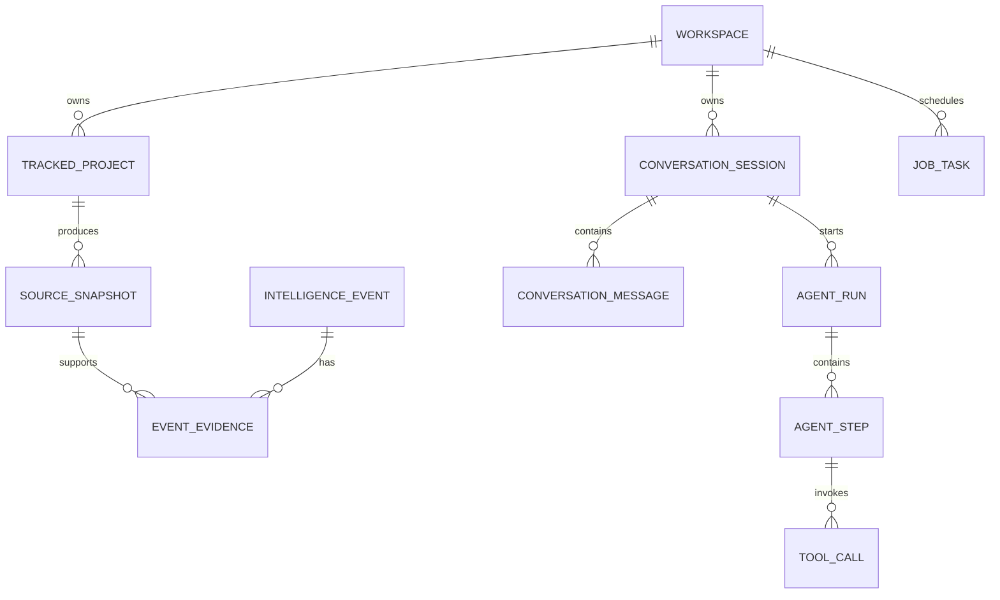

# P0领域模型

> 状态：工程基线
> 日期：2026-08-16

## 目标

只定义首条“GitHub Release → Tool Call → 带来源答案”链路及后续采集所需的最小数据模型，不提前创建完整RAG和企业权限模型。

## 实体

| 实体 | 作用 | 关键业务键 |
|---|---|---|
| `Workspace` | 隔离项目、会话和运行数据 | `code` |
| `TrackedProject` | 保存要跟踪的GitHub项目 | `workspaceId + projectKey` |
| `SourceSnapshot` | 保存一次外部来源快照 | `projectId + sourceType + externalId` |
| `IntelligenceEvent` | 从来源中提取的版本/功能/安全等事件 | `workspaceId + dedupeKey` |
| `EventEvidence` | 事件与原始来源之间的证据关系 | `eventId + snapshotId + sourceUrl` |
| `ConversationSession` | 用户研究会话 | UUID |
| `ConversationMessage` | 用户、助手、工具和系统消息 | `sessionId + sequenceNo` |
| `AgentRun` | 一次完整Agent执行 | UUID + TraceId |
| `AgentStep` | Run内可追踪步骤 | `runId + stepNo` |
| `ToolCall` | 工具请求、结果与耗时 | UUID |
| `JobTask` | 采集、入库、报告等异步任务 | `jobType + businessKey` |

## P0不创建

- 文档Chunk和固定维度向量列。
- Prompt版本和灰度表。
- 多租户计费表。
- MCP Server配置表。
- 审批流表。
- Excel/数据库语义层表。

这些对象在对应Phase通过ADR和迁移加入。

## 关键关系

## 数据边界

- 每个业务对象必须携带或可追溯到 `workspace_id`。
- Tool Result只保存受控摘要；大型原始响应进入`source_snapshot`或对象存储。
- Agent最终答案中的引用必须指向`event_evidence`或可验证的外部URL。
- Token和费用保存为统计数据，不保存API Key。
