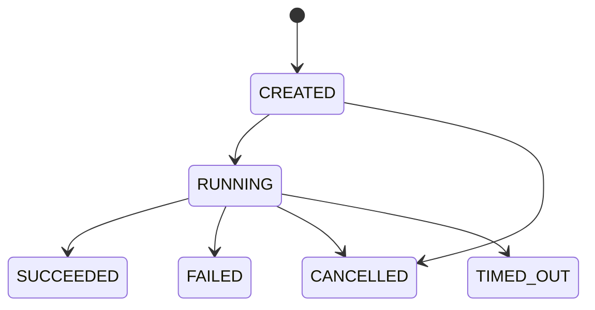
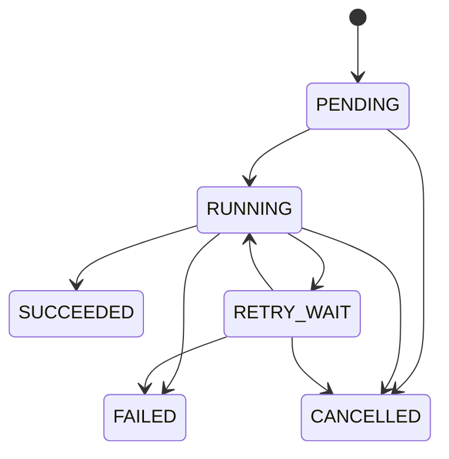

# P0状态机

> 状态：工程基线
> 日期：2026-08-16

## Agent Run



终态：`SUCCEEDED`、`FAILED`、`CANCELLED`、`TIMED_OUT`。

## Tool Call


工具执行失败不得自动把整个Run标为成功；由Agent策略决定重试、降级或终止。

## Job Task



## 转换规则

1. 所有转换使用白名单，不允许任意状态覆盖。
2. 终态不可回到非终态。
3. 状态更新使用乐观锁或条件更新。
4. Worker领取任务时同时写入`locked_by`、`locked_at`和心跳。
5. 超过租约的`RUNNING`任务可由恢复器重新进入`RETRY_WAIT`，但必须增加尝试次数并写审计。
6. 用户取消优先于新工具调用；已产生副作用的工具必须通过幂等和补偿处理。
7. P0工具均为只读，不允许写外部业务系统。

## 失败分类

```text
VALIDATION_ERROR     输入或Schema错误，不重试
AUTHENTICATION_ERROR 密钥或权限错误，不重试
RATE_LIMITED         按服务端提示有限退避
TRANSIENT_REMOTE     网络或5xx，有限重试
TIMEOUT              超过截止时间，取消
CANCELLED            用户或系统主动取消
INTERNAL_ERROR       未分类内部错误，告警并终止
```

## 验收

- Core中每个状态机都有允许与拒绝转换测试。
- 数据库状态约束与Java枚举一致。
- API不能直接指定任意新状态。
- 终态转换失败时不得静默覆盖。
