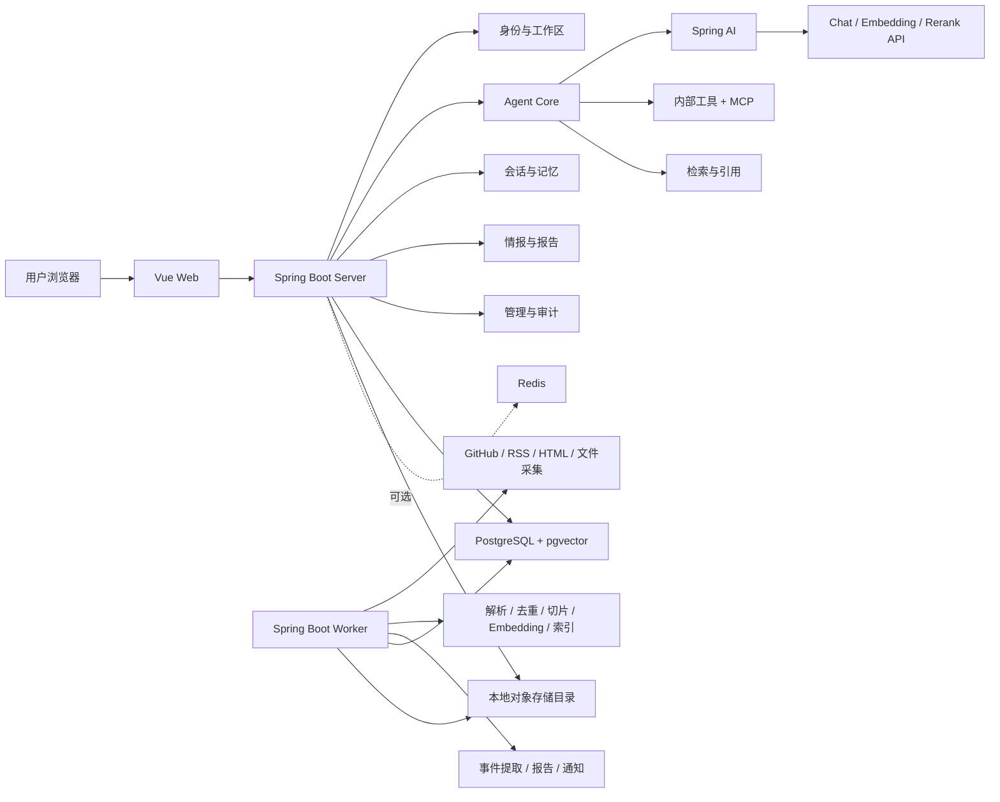

# AI / 开源软件行业情报 Agent：技术与工具

> 文档类型：技术基线与环境准备清单（Living Document）
> 适用项目：InsightOps Agent（暂定名）
> 对应规划：[AGENT项目与进度.md](./AGENT项目与进度.md)
> 技术基线日期：2026-07-31
> 当前版本：v0.1
> 当前状态：技术选型完成，等待创建新项目骨架

---

## 0. 文档用途

本文档用于回答以下问题：

1. 初步完成 AI / 开源软件行业情报 Agent，需要掌握和准备哪些技术。
2. 后端、前端、Agent、RAG、采集、任务、存储和部署采用什么架构。
3. 哪些框架首版必须使用，哪些后续再引入，哪些暂时不要使用。
4. 开发电脑、软件、账号、密钥、数据和测试环境需要准备什么。
5. 每个技术组件在系统中负责什么，如何验证已经准备完成。
6. 后续升级版本或改变选型时，如何记录决策。

### 0.1 更新规则

- 精确版本发生变化时，更新“版本基线”和更新日志。
- 引入新依赖前，先说明用途、替代方案、许可证和运维成本。
- 一个框架只解决一类问题，避免同时引入多个功能重叠的 Agent 框架。
- 只有在当前方案无法满足经过验证的需求时，才增加新的中间件。
- 每个环境组件必须有健康检查、启动方式和删除数据后的重建方式。

---

## 1. 最终技术结论

### 1.1 首版推荐技术路线

```text
Windows 11 + WSL2 / Docker Desktop

Java 21
Spring Boot 4.1
Spring AI 2.0
Spring MVC + SSE
Spring Security
Spring Data JPA + JdbcClient
Flyway

PostgreSQL 18
pgvector 0.8.2
本地文件存储
Redis（按需启用）

Vue 3 + TypeScript
Vite
Element Plus
Pinia
Vue Router
ECharts

GitHub REST API
RSS / Atom
官网 HTML
Markdown / PDF / Word

Docker Compose
GitHub Actions
JUnit 5 + Testcontainers
Vitest + Playwright
```

### 1.2 Agent 框架结论

首版只选择一个主要 AI 框架：

> **Spring AI 2.0**

使用 Spring AI 负责：

- Chat Model 和 Embedding Model 抽象。
- 同步与流式模型调用。
- Tool Calling 基础协议。
- VectorStore 与 pgvector 集成。
- RAG Advisor 和 ETL 基础能力。
- MCP Client / Server 集成。
- 模型调用基础可观测。

项目自己负责：

- Agent Run、Step 和状态机。
- 最大步骤数、Token、时间和成本预算。
- 会话、长期记忆和上下文裁剪。
- 工具权限、超时、幂等和审计。
- 人工审批。
- 研究主题、事件、报告和定时任务。
- 输入、输出和外部内容 Guardrail。
- 评测、发布门禁和业务指标。

### 1.3 为什么不继续叠加 LangChain4j

- Spring AI 已经覆盖模型、流式调用、工具、向量存储、RAG、ETL 和 MCP。
- 新项目基于 Spring Boot，Spring AI 的自动配置和观测集成更自然。
- 同时使用 Spring AI 和 LangChain4j 会产生两套模型、消息、工具和向量抽象。
- Agent 业务状态仍需自己实现，额外框架不能代替工程化工作。

只有当 Spring AI 无法支持一个已经确认的关键模型或协议时，才重新评估其他框架。

### 1.4 P0 模型决策

- Chat Provider 使用 DeepSeek 官方 API。
- 默认模型使用 `deepseek-v4-flash`，后续复杂专题研究再评测 `deepseek-v4-pro`。
- P0 显式关闭思考模式，优先保证 Tool Calling、流式、成本和审计链路简单可靠。
- 使用 Spring AI 原生 DeepSeek Starter，业务层通过自有 `ChatModelPort` 隔离 Provider。
- P0 不启用 Embedding；完整 RAG 阶段再单独选择 Provider、模型和固定向量维度。
- API Key 只从 `DEEPSEEK_API_KEY` 环境变量读取，不进入仓库、日志、前端或工具结果。

详细决策见 `docs/architecture/ADR-003-deepseek-model.md`，验证方案见 `docs/testing/deepseek-smoke-test-plan.md`。

---

## 2. 版本基线

> 以下版本是 2026-07-31 的建议基线。创建骨架时必须通过一次兼容性 Spike，再在构建文件和锁文件中固定。

| 组件 | 推荐基线 | 选择原因 |
|---|---|---|
| Java | JDK 21 LTS | 已有经验、虚拟线程、长期支持 |
| Maven | 3.9.x + Maven Wrapper | 构建可复现，不依赖开发机全局版本 |
| Spring Boot | 4.1.0 | 当前稳定版本 |
| Spring AI | 2.0.0 | 当前稳定版本，支持 Tool、VectorStore、ETL、MCP |
| PostgreSQL | 18.x 当前小版本 | 官方支持到 2030 年 |
| pgvector | 0.8.2 | 支持 PostgreSQL 18，具备 HNSW 和过滤能力 |
| Node.js | 24 LTS | 当前 Active LTS |
| Vue | Vue 3 当前稳定版 | 组件生态成熟 |
| TypeScript | 当前稳定版 | 前端类型安全 |
| Vite | 与 Node 24 兼容的稳定版 | 构建速度和 Vue 集成 |
| Docker | Docker Engine / Desktop 当前稳定版 | 本地环境标准化 |
| Docker Compose | Compose v2 | 管理本地依赖 |

### 2.1 兼容性回退方案

如果 Spring Boot 4.1 与必须使用的第三方库存在明确兼容问题：

```text
回退组合：
Spring Boot 3.5.x
Spring AI 1.1.x
JDK 21
```

回退必须满足：

- 有可以复现的兼容性错误。
- 无法通过升级第三方库解决。
- 在架构决策记录中写明原因。
- 不使用 Snapshot 或 Milestone 版本作为正式基线。

### 2.2 官方版本依据

- [Spring Boot 官方项目页](https://spring.io/projects/spring-boot/)
- [Spring AI 官方 API 概览](https://docs.spring.io/spring-ai/reference/api/)
- [Spring AI 2.0 Upgrade Notes](https://docs.spring.io/spring-ai/reference/upgrade-notes.html)
- [Node.js 官方版本状态](https://nodejs.org/en/about/previous-releases)
- [PostgreSQL 官方版本支持策略](https://www.postgresql.org/support/versioning/)
- [pgvector 官方仓库](https://github.com/pgvector/pgvector)

---

## 3. 总体架构

### 3.1 首版部署形态

首版采用：

> **一个代码仓库、一个模块化后端、一个 Worker 进程、一个 Web 前端。**

不是十二个微服务，也不需要独立网关、Nacos、Kafka、Milvus 和 Kubernetes。



### 3.2 为什么保留独立 Worker

以下任务不应占用用户请求线程：

- 网页和 GitHub 数据采集。
- PDF、Word 和 HTML 解析。
- 批量 Embedding。
- 文档切片和索引。
- 事件提取和内容去重。
- 日报、周报和专题报告生成。
- 大文件导出。
- 失败任务重试。

Server 与 Worker：

- 使用同一套领域模块。
- 连接同一个 PostgreSQL。
- 通过任务表领取任务。
- 可以在本地以两个进程运行。
- 未来有吞吐压力时再独立扩容 Worker。

### 3.3 任务队列方案

第一版使用 PostgreSQL 任务表：

```text
job_task
├─ id
├─ job_type
├─ business_key
├─ payload_json
├─ status
├─ priority
├─ retry_count
├─ max_retries
├─ next_run_time
├─ locked_by
├─ locked_at
├─ heartbeat_at
├─ started_at
├─ finished_at
└─ error_message
```

Worker 使用 `FOR UPDATE SKIP LOCKED` 领取任务。

必须支持：

- 业务幂等键。
- 心跳和超时回收。
- 指数退避。
- 最大重试次数。
- 手工重新执行。
- 取消和暂停。
- 服务重启后的任务恢复。

只有出现以下情况才考虑 Kafka：

- 持续高吞吐事件流。
- 多个独立消费者。
- 需要外部系统订阅事件。
- PostgreSQL 任务队列经压测无法满足目标。

---

## 4. 推荐项目目录

以后 Agent 项目统一保存在：

```text
D:\AGENT-JUNDAO\1-Agent-LJW
```

建议目录结构：

```text
1-Agent-LJW/
├─ AGENT项目与进度.md
├─ 技术and工具.md
└─ insightops-agent/
   ├─ pom.xml
   ├─ mvnw
   ├─ mvnw.cmd
   ├─ .mvn/
   ├─ apps/
   │  ├─ server/
   │  ├─ worker/
   │  └─ web/
   ├─ modules/
   │  ├─ foundation/
   │  ├─ identity/
   │  ├─ model/
   │  ├─ agent/
   │  ├─ conversation/
   │  ├─ knowledge/
   │  ├─ research/
   │  ├─ tool/
   │  ├─ job/
   │  ├─ audit/
   │  └─ evaluation/
   ├─ infra/
   │  ├─ compose.yaml
   │  ├─ migrations/
   │  ├─ docker/
   │  └─ monitoring/
   ├─ data/
   │  ├─ samples/
   │  └─ eval/
   └─ docs/
      ├─ product/
      ├─ architecture/
      ├─ api/
      └─ operations/
```

### 4.1 模块职责

| 模块 | 职责 |
|---|---|
| `foundation` | 统一错误、TraceId、时间、分页、JSON、基础约束 |
| `identity` | 用户、角色、工作区、登录和数据隔离 |
| `model` | Chat、Stream、Embedding、Rerank Provider 适配 |
| `agent` | Agent Run、Step、预算、状态机、上下文和 Guardrail |
| `conversation` | 会话、消息、摘要和长期记忆 |
| `knowledge` | 数据源、文档、版本、切片、向量、检索和引用 |
| `research` | 跟踪项目、研究主题、情报事件、时间线和报告 |
| `tool` | 工具目录、Schema、执行、权限、MCP 和审批 |
| `job` | 任务领取、调度、重试、恢复和导出 |
| `audit` | 模型、检索、工具、审批和用户操作日志 |
| `evaluation` | 评测数据集、运行、指标和发布门禁 |
| `server` | REST、SSE、鉴权、参数转换和 Web API |
| `worker` | 采集、入库、Embedding、事件提取和报告任务 |
| `web` | 聊天、情报、报告、任务、日志和系统管理页面 |

---

## 5. 后端框架与依赖

### 5.1 首版必须依赖

| 类别 | 框架 / 工具 | 用途 |
|---|---|---|
| Web | Spring MVC | REST API 和 SSE |
| AI | Spring AI | 模型、工具、RAG、VectorStore、MCP |
| Security | Spring Security | 登录、角色、工作区权限 |
| Validation | Jakarta Validation | 请求和工具参数校验 |
| Persistence | Spring Data JPA | 业务实体通用持久化 |
| SQL | Spring `JdbcClient` | 任务领取、复杂查询和显式 SQL |
| Migration | Flyway | 数据库版本迁移 |
| Database | PostgreSQL JDBC Driver | PostgreSQL 连接 |
| Vector | Spring AI PgVectorStore | pgvector 访问 |
| Health | Spring Boot Actuator | 健康检查和指标 |
| HTML | jsoup | HTML 下载后的正文解析和链接处理 |
| RSS | ROME | RSS / Atom 解析 |
| Document | Apache Tika | 文件类型识别和通用文本抽取 |
| PDF | Apache PDFBox | PDF 文本、页码和元数据 |
| Office | Apache POI | Word、Excel 读取和 Excel 报告 |
| Markdown | flexmark-java | Markdown 解析 |
| Test | JUnit 5 | 单元和集成测试 |
| Container Test | Testcontainers | PostgreSQL / pgvector 集成测试 |
| HTTP Mock | WireMock | GitHub、模型和网页接口模拟 |

### 5.2 可选依赖

| 框架 / 工具 | 何时引入 |
|---|---|
| Redis | 多实例缓存、分布式限流或短期状态确有需要时 |
| Caffeine | 单实例本地缓存 |
| Resilience4j | 外部 API 调用需要统一熔断、限流和重试时 |
| Quartz | 普通数据库任务调度不能满足复杂日历计划时 |
| Bucket4j | 需要工作区或接口级令牌桶限流时 |
| OpenTelemetry | Alpha 链路稳定后建立跨进程 Trace |
| Prometheus / Grafana | 部署测试或公开 Beta 时 |
| Loki | 日志量达到需要集中检索时 |
| Playwright Java | 必须采集 JavaScript 动态渲染页面时 |

### 5.3 首版不要引入

- LangChain4j。
- Spring Cloud 全家桶。
- Nacos。
- Spring Cloud Gateway。
- OpenFeign。
- Kafka。
- XXLJob。
- Milvus。
- Elasticsearch / OpenSearch。
- Neo4j。
- Kubernetes。
- 服务网格。
- 自研通用 CRUD / Dispatch 大基类。

### 5.4 数据访问原则

- JPA 负责普通业务实体和关联关系。
- `JdbcClient` 负责显式 SQL、任务领取和批处理。
- Flyway 负责所有表结构变更。
- 不使用 `ddl-auto=update` 管理正式数据库结构。
- 向量维度由 Embedding 模型决定，首次建库后不能随意修改。
- Embedding 模型变更时创建新向量版本，不覆盖旧版本。

---

## 6. Spring AI 的使用边界

### 6.1 使用能力

Spring AI 官方提供：

- Provider 可移植的 Chat 和 Embedding Model API。
- 同步和流式调用。
- ChatClient。
- Tool Calling。
- VectorStore。
- Advisors。
- RAG 和 ETL 基础能力。
- MCP Client / Server。
- Spring Boot 自动配置。

参考：

- [Spring AI API](https://docs.spring.io/spring-ai/reference/api/)
- [Spring AI Tool Calling](https://docs.spring.io/spring-ai/reference/api/tools.html)
- [Spring AI MCP Server](https://docs.spring.io/spring-ai/reference/api/mcp/mcp-server-boot-starter-docs.html)

### 6.2 自定义 AgentRunner

建议保留一个项目自己的 `AgentRunner`：

```text
AgentRunner
├─ 创建 AgentRun
├─ 加载会话和研究上下文
├─ 检查输入
├─ 设置模型、工具和预算
├─ 调用 Spring AI ChatClient
├─ 拦截每次 Tool Call
├─ 校验权限和风险级别
├─ 保存 Step 与 Tool Call
├─ 处理取消、超时和重试
├─ 检查输出与引用
└─ 完成或失败 AgentRun
```

### 6.3 Tool Calling 策略

只读、低风险工具：

- 可以由 Spring AI 自动完成工具循环。
- 仍必须经过统一执行器记录。

写入或高风险工具：

- 不能直接自动执行。
- 工具先返回 `ApprovalRequired`。
- 用户确认后生成新的执行任务。
- 执行结果重新写入 Agent Run。

### 6.4 会话记忆策略

不把 Spring AI 内存实现作为唯一事实来源。

数据库保存：

- 原始消息。
- 工具调用。
- Agent Step。
- 引用。
- 会话摘要。
- 用户修正。

发送给模型的上下文由项目根据 Token 预算动态组装。

---

## 7. 模型与 AI 能力准备

### 7.1 首版至少需要三种能力

| 能力 | 必须具备 | 主要用途 |
|---|---|---|
| Chat Model | 流式、Tool Calling、结构化输出 | 对话、规划、事件提取、报告 |
| Embedding Model | 中英文、稳定维度、批量接口 | 文档和事件向量 |
| Rerank Model | Query + 文档列表打分 | 提高检索准确率 |

Rerank 在最早的垂直切片中可以暂时关闭，但在 RAG Alpha 前必须接入或完成替代验证。

### 7.2 Provider 接口

项目内部定义：

```text
ChatModelPort
├─ chat()
└─ stream()

EmbeddingModelPort
├─ embed()
└─ embedBatch()

RerankModelPort
└─ rerank()
```

每次调用保存：

- Provider。
- 模型名称和版本。
- 输入 / 输出 Token。
- 耗时。
- 重试次数。
- 成本估算。
- TraceId。
- 错误类别。

### 7.3 模型选择要求

选择模型时必须验证：

- 中文和英文能力。
- Tool Calling 参数准确率。
- JSON Schema / Structured Output。
- SSE 或流式响应。
- 上下文长度。
- API 稳定性和限流说明。
- 数据保留策略。
- 单价和预算控制。

### 7.4 首版模型策略

- 先接入一个支持 OpenAI-compatible API 的云模型。
- 不在第一阶段部署本地大模型。
- 不要求 GPU。
- 模型接口必须允许未来接入第二家 Provider。
- 评测集稳定后再决定快模型、强模型和低成本模型的分工。

### 7.5 环境变量

只定义变量名，不在仓库中写真实值：

```text
MODEL_PROVIDER
MODEL_BASE_URL
MODEL_API_KEY
MODEL_CHAT_NAME
MODEL_EMBEDDING_NAME
MODEL_RERANK_NAME
MODEL_REQUEST_TIMEOUT
MODEL_MAX_RETRIES
MODEL_MONTHLY_BUDGET
```

---

## 8. 情报数据源

### 8.1 Alpha 首批数据源

| 数据源 | 采集方式 | 优先级 |
|---|---|---:|
| GitHub Repository | GitHub REST API | P0 |
| GitHub Release | GitHub REST API | P0 |
| GitHub Issue / Pull Request | GitHub REST API | P0 |
| 官方博客 | RSS / Atom 优先，HTML 备用 | P0 |
| 官方更新日志 | HTML / Markdown | P0 |
| 官方文档 | HTML / Markdown | P0 |
| 用户上传 PDF / Markdown | 文件上传 | P0 |
| GitHub Security Advisory | 官方 API | P1 |
| arXiv 论文 | arXiv API / RSS | P1 |
| 通用 Web Search | 搜索 API 适配器 | P1 |
| JavaScript 动态网页 | Playwright | P2 |

### 8.2 为什么先不做全网爬虫

- 数据质量不稳定。
- 容易遇到反爬、登录、版权和页面结构变化。
- 难以验证来源可信度。
- 会大幅增加代理、浏览器和任务调度成本。
- 行业情报 Alpha 可以依靠官方来源形成高质量产品。

首版原则：

> 官方 API > RSS / Atom > 官方静态页面 > 用户上传 > 搜索引擎 > 动态浏览器采集。

### 8.3 来源可信等级

| 等级 | 来源 | 使用方式 |
|---|---|---|
| A | 官方仓库、官方文档、官方公告 | 可作为关键事实主要来源 |
| B | 维护者博客、基金会、标准组织 | 可作为主要或补充来源 |
| C | 有署名的技术媒体和社区文章 | 需要交叉验证 |
| D | 无明确作者或来源的聚合内容 | 不用于关键结论 |

### 8.4 GitHub API 实现要求

- 使用 Fine-grained Token 或 GitHub App。
- 明确设置 `User-Agent`。
- 固定受支持的 `X-GitHub-Api-Version`。
- 保存 `ETag` 和 `Last-Modified`。
- 使用条件请求减少配额消耗。
- 读取 `X-RateLimit-*` 响应头。
- 收到限流后按 `Retry-After` 或重置时间重试。
- 不无控制地并发轮询。
- 能用 Webhook 时优先 Webhook，Alpha 可先定时采集。

参考：

- [GitHub REST API Best Practices](https://docs.github.com/en/rest/using-the-rest-api/best-practices-for-using-the-rest-api)
- [GitHub REST API Rate Limits](https://docs.github.com/en/rest/using-the-rest-api/rate-limits-for-the-rest-api)

### 8.5 数据源环境变量

```text
GITHUB_API_BASE_URL
GITHUB_API_VERSION
GITHUB_TOKEN
HTTP_USER_AGENT
HTTP_CONNECT_TIMEOUT
HTTP_READ_TIMEOUT
COLLECTOR_MAX_CONCURRENCY
COLLECTOR_DEFAULT_INTERVAL
```

---

## 9. 采集与知识入库技术

### 9.1 完整入库流水线

```mermaid
flowchart LR
    S["Source"] --> F["Fetch"]
    F --> RAW["Raw Snapshot"]
    RAW --> HASH["Hash / Conditional Metadata"]
    HASH --> PARSE["Parse"]
    PARSE --> CLEAN["Normalize / Clean"]
    CLEAN --> DEDUP["Exact + Semantic Dedup"]
    DEDUP --> CHUNK["Chunk"]
    CHUNK --> EMBED["Embedding"]
    EMBED --> INDEX["pgvector Index"]
    INDEX --> EVENT["Event Extraction"]
    EVENT --> PUBLISH["Publish Version"]
```



### 9.2 原始快照

任何内容在解析前先保存原始快照：

- 来源 ID。
- 原始 URL。
- HTTP 状态码。
- Content-Type。
- ETag。
- Last-Modified。
- 抓取时间。
- SHA-256。
- 原始文件位置。
- 解析状态。

这样可以：

- 重新解析而无需再次访问外部网站。
- 对比版本变化。
- 证明报告基于哪个时间点的数据。
- 修复解析器后批量重建。

### 9.3 内容解析器

| 内容 | 工具 | 输出要求 |
|---|---|---|
| HTML | jsoup + 自定义正文规则 | 标题、正文、链接、发布时间 |
| RSS / Atom | ROME | Entry ID、标题、时间、链接、摘要 |
| Markdown | flexmark-java | 标题层级、代码块、链接 |
| PDF | PDFBox / Tika | 页码、文本、元数据 |
| Word | Apache POI / Tika | 标题、段落、表格 |
| GitHub JSON | Jackson | Repository、Release、Issue 等结构化对象 |

### 9.4 清洗规则

- 移除菜单、页脚、导航和重复版权信息。
- 保留标题层级。
- 保留代码块和版本号。
- 规范化空白、Unicode 和换行。
- 不丢失原始 URL、页码和段落位置。
- 记录清洗器版本。

### 9.5 去重策略

按顺序执行：

1. 来源外部 ID 去重。
2. URL 规范化。
3. 原始内容 SHA-256。
4. 规范化正文 SHA-256。
5. 标题 + 时间 + 来源复合键。
6. Embedding 相似度进行近似重复检测。

近似重复不能直接物理删除，应建立“同一事件 / 相似内容”关联。

### 9.6 切片策略

首版采用确定性切片：

- 优先按 Markdown / HTML 标题层级。
- 再按段落。
- 超长段落按 Token 数拆分。
- 保留少量重叠。
- 代码块和表格尽量整体保留。
- 每个 Chunk 保存标题路径和原文位置。

每个 Chunk 至少保存：

```text
chunk_id
document_version_id
chunk_index
heading_path
content
token_count
source_locator
embedding_model
embedding_version
metadata_json
```

### 9.7 向量索引

使用 PostgreSQL 18 + pgvector 0.8.2：

- 首版默认余弦距离。
- 数据量较小时先精确检索。
- 数据量达到基线后再创建 HNSW。
- Metadata 必须包含工作区、来源、项目、文档版本和时间。
- 查询必须过滤未发布、已删除和无权限的文档。
- Embedding 维度必须与表结构一致。

### 9.8 文档更新与删除

更新：

1. 创建新 `document_version`。
2. 完成解析、切片和索引。
3. 通过质量检查后原子切换当前版本。
4. 旧版本保留到清理期。

删除：

1. 标记文档删除。
2. 立即停止检索。
3. 异步删除 Chunk 和向量。
4. 验证向量数量和关联记录。
5. 写入删除审计。

---

## 10. 检索、引用与 RAG

### 10.1 首版检索链

```text
用户问题
→ 查询理解与时间范围识别
→ Metadata Filter
→ pgvector 语义检索
→ 关键词 / 精确条件补充
→ 合并与去重
→ Rerank
→ 相邻 Chunk 合并
→ 引用构建
→ 模型生成答案
→ 答案引用检查
```

### 10.2 首版不引入 Elasticsearch

首版使用：

- pgvector 语义检索。
- PostgreSQL 基础全文 / `ILIKE` / Trigram 辅助。
- 标题、项目、版本、日期等结构化过滤。
- Rerank 提高最终候选质量。

达到以下条件再评估 OpenSearch：

- 文档和 Chunk 数量达到当前方案性能瓶颈。
- 需要复杂 BM25、聚合、高亮和多字段相关性。
- 有明确压测数据证明 PostgreSQL 方案不足。

### 10.3 引用模型

每条引用包含：

```text
citation_id
agent_run_id
document_version_id
chunk_id
source_name
source_url
title
published_at
locator
quoted_text
retrieval_score
rerank_score
```

最终回答要求：

- 关键事实附近显示引用。
- 引用能够打开原始来源。
- PDF 引用能够定位页码。
- GitHub 引用能够定位仓库、Release、Issue 或文件。
- 引用文本必须确实支持对应结论。

### 10.4 防止“有引用但引用不支持答案”

- 生成前只提供已通过来源过滤的证据。
- 生成后检查事实句是否绑定引用。
- 对时间、版本、数量和状态等事实进行规则校验。
- 评测中人工标注“引用是否支持结论”。
- 低置信度时明确说明不确定，而不是补全事实。

---

## 11. 行业情报领域工具

### 11.1 Alpha 工具清单

| Tool Name | 输入 | 输出 | 风险 |
|---|---|---|---|
| `project_get` | 项目标识 | 项目基础资料 | 低 |
| `github_repo_overview` | owner、repo | 仓库、License、语言、活跃度 | 低 |
| `github_release_list` | repo、时间范围 | Release 列表 | 低 |
| `github_issue_search` | repo、条件 | Issue / PR 摘要 | 低 |
| `source_document_search` | query、filter | 文档候选和引用 | 低 |
| `source_snapshot_open` | snapshotId | 原始快照信息 | 低 |
| `intelligence_event_search` | 项目、类型、时间 | 情报事件 | 低 |
| `project_compare` | 项目列表、维度 | 对比数据 | 低 |
| `timeline_build` | 主题、时间范围 | 事件时间线 | 低 |
| `report_draft` | 模板、证据、范围 | 报告草稿 | 中 |
| `report_export` | reportId、格式 | 导出任务 | 中 |
| `tracking_rule_create` | 项目、来源、频率 | 待审批动作 | 高 |

### 11.2 工具统一元数据

每个工具必须定义：

```text
name
version
description
input_schema
output_schema
risk_level
required_permissions
timeout
max_retries
idempotent
approval_required
enabled
```

### 11.3 工具执行要求

- 模型不能直接访问数据库连接。
- 模型只能通过受控工具查询数据。
- 所有参数经过 JSON Schema 和业务校验。
- URL 必须经过来源白名单和 SSRF 检查。
- 结果限制大小，超大结果保存为资源引用。
- Tool Call、参数摘要、耗时和结果状态必须入库。
- 密钥、Token 和敏感配置不能返回给模型。

### 11.4 MCP 方案

Alpha：

- 内部 Tool SPI 为主。
- 保持名称、描述和 JSON Schema 可映射到 MCP。

Beta：

- 将研究查询和报告能力暴露为 MCP Server。
- 允许连接可信 MCP Server。
- 使用 Streamable HTTP，不新建已经废弃的 SSE MCP 服务。
- 外部 MCP 工具进入同一权限、审计和审批链。

---

## 12. 情报事件模型

### 12.1 事件类型

首版事件类型：

- `RELEASE`：发布新版本。
- `FEATURE`：新增重要功能。
- `BREAKING_CHANGE`：不兼容变更。
- `DEPRECATION`：弃用或停止支持。
- `SECURITY`：安全公告或修复。
- `LICENSE`：许可证变化。
- `PRICING`：价格或收费方式变化。
- `INTEGRATION`：新增协议、插件或生态集成。
- `GOVERNANCE`：基金会、维护组织或治理变化。
- `MILESTONE`：重大采用、性能或社区里程碑。

### 12.2 事件字段

```text
event_id
workspace_id
tracked_project_id
event_type
title
summary
event_time
detected_at
importance
confidence
source_count
status
dedup_group
structured_data_json
created_by
```

### 12.3 事件提取

采用两阶段：

1. 规则提取版本号、发布日期、CVE、License 和链接等确定信息。
2. 模型输出结构化事件 JSON。

事件发布前检查：

- 是否存在至少一个 A / B 级来源。
- 日期和版本是否可以从来源验证。
- 是否与已有事件重复。
- 模型摘要是否包含来源不存在的事实。

低置信度事件进入人工复核。

---

## 13. 前端技术与页面

### 13.1 前端技术栈

| 技术 | 用途 |
|---|---|
| Vue 3 | UI 框架 |
| TypeScript | 类型安全 |
| Vite | 开发与构建 |
| Vue Router | 路由 |
| Pinia | 用户、工作区和页面状态 |
| Element Plus | 基础管理组件 |
| ECharts | 情报趋势、时间线和对比图表 |
| Markdown Renderer | 报告和答案展示 |
| Shiki / highlight.js | 代码和配置高亮 |
| Vitest | 单元和组件测试 |
| Playwright | 端到端测试 |

### 13.2 Alpha 页面

1. 登录。
2. 工作台首页。
3. 跟踪项目列表和详情。
4. 数据源列表和采集状态。
5. 情报事件时间线。
6. 研究对话。
7. 报告列表、详情和导出。
8. 定时任务和失败任务。
9. Agent Run / Step / Tool Call 详情。
10. 模型、Prompt 和系统设置。
11. 评测数据集和运行结果。

### 13.3 SSE 前端要求

- 支持 `start`、`thinking`、`tool_call`、`tool_result`、`answer_chunk`、`citation`、`done`、`error`。
- 页面刷新后可以根据 Run ID 恢复最终结果。
- 用户可以停止当前 Run。
- 网络中断后显示明确状态。
- Token 内容和结构化事件分开处理。
- 不把服务器错误直接显示为 `undefined`。

### 13.4 前端质量工具

- ESLint。
- Prettier。
- TypeScript 严格模式。
- API 类型自动生成或共享 Schema。
- `npm ci` 保证 CI 依赖一致。
- 构建产物体积报告。

---

## 14. 核心数据库对象

### 14.1 账号和权限

- `app_user`
- `workspace`
- `workspace_member`
- `role`
- `permission`

### 14.2 数据源和知识库

- `data_source`
- `source_fetch_state`
- `source_snapshot`
- `knowledge_base`
- `document`
- `document_version`
- `document_chunk`
- `embedding_version`

### 14.3 情报研究

- `tracked_project`
- `research_topic`
- `research_source_binding`
- `intelligence_event`
- `event_evidence`
- `report`
- `report_section`
- `report_citation`

### 14.4 Agent 与会话

- `conversation_session`
- `conversation_message`
- `conversation_summary`
- `agent_run`
- `agent_step`
- `tool_definition`
- `tool_call`
- `approval_request`
- `citation`

### 14.5 任务和审计

- `job_task`
- `export_job`
- `model_call_log`
- `retrieval_log`
- `operation_audit`
- `eval_dataset`
- `eval_case`
- `eval_run`
- `eval_result`

### 14.6 数据库设计要求

- 所有业务表包含创建时间和更新时间。
- 多工作区表必须包含 `workspace_id`。
- 外部对象保存 `external_id` 和来源。
- URL、状态、业务键建立必要索引。
- JSON 只保存扩展数据，不代替稳定结构字段。
- 删除、版本切换和任务状态必须有明确事务边界。
- 数据库字段和 API 字段使用统一命名规范。

---

## 15. 开发工具

### 15.1 必须安装

| 工具 | 用途 | 验证命令 |
|---|---|---|
| Git | 版本管理 | `git --version` |
| JDK 21 | Java 编译运行 | `java -version` |
| Maven | 首次生成 Wrapper | `mvn -version` |
| Maven Wrapper | 项目固定构建入口 | `mvnw.cmd -version` |
| Node.js 24 LTS | 前端运行环境 | `node -v` |
| npm | 前端依赖和脚本 | `npm -v` |
| Docker Desktop | 本地容器 | `docker version` |
| Docker Compose v2 | 本地依赖编排 | `docker compose version` |
| IDE | Java / Vue 开发 | 手工确认 |
| DBeaver | PostgreSQL 查看和 SQL 调试 | 手工确认 |
| Apifox / Postman | API 和 SSE 调试 | 手工确认 |

### 15.2 推荐安装

- IntelliJ IDEA。
- Visual Studio Code。
- PowerShell 7。
- GitHub CLI。
- pgAdmin（DBeaver 已满足时可不安装）。
- Bruno（需要把 API 用例纳入 Git 时可选）。
- draw.io 或 Mermaid 编辑器。

### 15.3 不需要准备

- 本地 GPU。
- 本地 Milvus。
- 本地 Elasticsearch。
- 本地 Kafka。
- Nacos。
- Kubernetes。
- 多台虚拟机。

---

## 16. 开发电脑与资源

### 16.1 推荐最低配置

| 资源 | 建议 |
|---|---|
| 操作系统 | Windows 11 64 位 |
| CPU | 4 核以上，推荐 8 核 |
| 内存 | 最低 16 GB，推荐 32 GB |
| 磁盘 | 至少预留 40 GB SSD |
| Docker | WSL2 后端 |
| GPU | 使用云模型时不需要 |

### 16.2 本地端口规划

| 服务 | 默认端口 |
|---|---:|
| Web | 5173 |
| Server API | 8080 |
| Worker Management | 8081 |
| PostgreSQL | 5432 |
| Redis（可选） | 6379 |
| Prometheus（后续） | 9090 |
| Grafana（后续） | 3000 |
| Mailpit（可选） | 8025 |

端口通过 `.env.local` 配置，不能散落在代码中。

### 16.3 本地 Docker Compose

Alpha 最小环境：

```text
PostgreSQL 18 + pgvector 0.8.2
```

可选：

```text
Redis
Mailpit
Prometheus
Grafana
```

原始文件通过本地挂载目录保存，不要求部署对象存储服务。

---

## 17. 需要准备的账号和密钥

### 17.1 P0 必须

- [ ] GitHub 个人账号。
- [ ] 新项目 GitHub 仓库。
- [ ] GitHub Fine-grained Token 或 GitHub App。
- [ ] 一个支持流式和 Tool Calling 的模型 API。
- [ ] 一个 Embedding API。
- [ ] 一个 Rerank API，或明确的暂缓方案。

### 17.2 P1 可选

- [ ] 域名。
- [ ] 云服务器。
- [ ] S3 兼容对象存储。
- [ ] 邮件服务。
- [ ] Webhook / 钉钉 / 企业微信测试应用。
- [ ] Web Search API。

### 17.3 密钥管理

本地：

- 使用未提交的 `.env.local`。
- 提供不含真实值的 `.env.example`。

CI：

- 使用 GitHub Actions Secrets。

生产：

- 使用部署平台 Secret 或独立 Secret Manager。

禁止：

- 在 Git 历史中提交密钥。
- 在日志中输出完整密钥。
- 将密钥作为 Tool Result 返回给模型。
- 把生产密钥放进前端。

---

## 18. 环境变量清单

### 18.1 数据库

```text
DB_HOST
DB_PORT
DB_NAME
DB_USERNAME
DB_PASSWORD
DB_POOL_MAX_SIZE
```

### 18.2 模型

```text
MODEL_PROVIDER
MODEL_BASE_URL
MODEL_API_KEY
MODEL_CHAT_NAME
MODEL_EMBEDDING_NAME
MODEL_RERANK_NAME
MODEL_REQUEST_TIMEOUT
MODEL_MAX_RETRIES
MODEL_MONTHLY_BUDGET
```

### 18.3 GitHub

```text
GITHUB_API_BASE_URL
GITHUB_API_VERSION
GITHUB_TOKEN
GITHUB_WEBHOOK_SECRET
```

### 18.4 文件和采集

```text
STORAGE_ROOT
UPLOAD_MAX_SIZE
HTTP_USER_AGENT
HTTP_CONNECT_TIMEOUT
HTTP_READ_TIMEOUT
COLLECTOR_MAX_CONCURRENCY
COLLECTOR_DEFAULT_INTERVAL
```

### 18.5 安全

```text
JWT_SIGNING_KEY
CONFIG_ENCRYPTION_KEY
ALLOWED_FETCH_HOSTS
CORS_ALLOWED_ORIGINS
```

---

## 19. 本地环境安装顺序

### Step 1：基础命令

确认：

```powershell
git --version
java -version
mvn -version
node -v
npm -v
docker version
docker compose version
```

验收：

- Java 显示 21。
- Node 显示 24.x LTS。
- Docker Engine 和 Compose 均可用。
- Maven 实际使用 JDK 21。

### Step 2：创建新项目目录

目标目录：

```text
D:\AGENT-JUNDAO\1-Agent-LJW\insightops-agent
```

创建：

- Maven 父项目。
- Server。
- Worker。
- Modules。
- Vue Web。
- Infra。
- Docs。

### Step 3：创建 Compose

启动 PostgreSQL + pgvector。

验收：

- PostgreSQL 健康检查通过。
- `CREATE EXTENSION vector` 成功。
- DBeaver 可以连接。
- 数据目录持久化。

### Step 4：建立工程验证

后端：

```powershell
.\mvnw.cmd -B verify
```

前端：

```powershell
npm ci
npm run lint
npm run test
npm run build
```

### Step 5：接入模型

只完成：

- 一个 Chat Model。
- 一个 Streaming API。
- 一个 Embedding Model。
- 一条自动测试或可重复 Smoke Test。

不要在此阶段同时实现多个 Provider。

---

## 20. 测试工具与策略

### 20.1 后端测试

| 测试 | 工具 | 内容 |
|---|---|---|
| 单元测试 | JUnit 5 + Mockito | 状态机、去重、预算、权限、解析 |
| Repository 测试 | Testcontainers PostgreSQL | 实体、迁移、查询和锁 |
| pgvector 测试 | Testcontainers | 写入、过滤、删除、相似检索 |
| HTTP 适配器测试 | WireMock | GitHub、RSS、模型和网页错误 |
| Controller 测试 | MockMvc | 参数、权限、响应和 SSE |
| 契约测试 | JSON Schema / 固定 Fixture | Tool、API、模型结构化输出 |
| 任务测试 | Testcontainers + 可控时钟 | 领取、重试、恢复和幂等 |

### 20.2 前端测试

| 测试 | 工具 | 内容 |
|---|---|---|
| 单元测试 | Vitest | Store、工具函数、SSE 解析 |
| 组件测试 | Vue Test Utils | 表格、报告和运行详情 |
| E2E | Playwright | 登录、提问、工具、报告和任务 |

### 20.3 Agent 评测

评测数据格式建议使用 JSONL：

```json
{
  "id": "release-001",
  "question": "项目 X 在最近一个月有哪些重要版本变化？",
  "expectedProjects": ["X"],
  "expectedEventTypes": ["RELEASE", "FEATURE"],
  "requiredSourceIds": ["source-1"],
  "expectedFacts": ["..."],
  "forbiddenFacts": ["..."],
  "expectedTools": ["github_release_list", "source_document_search"]
}
```

至少评测：

- 检索命中。
- 引用支持度。
- 事实正确性。
- 事件分类。
- Tool 选择。
- Tool 参数。
- 报告完整性。
- 延迟。
- Token 和成本。

### 20.4 测试分层

```text
每次提交：
单元 + Repository + 前端单元 + Lint

Pull Request：
全部集成测试 + 前端构建 + 契约测试

定时或发布前：
在线模型评测 + E2E + 安全扫描
```

在线模型测试单独标记，避免普通单测产生不可控费用。

---

## 21. 可观测与调试工具

### 21.1 Alpha 必须记录

- HTTP TraceId。
- Agent Run ID。
- Agent Step。
- Tool Call。
- 模型请求元数据。
- 检索候选和最终引用。
- 采集和入库任务。
- 任务重试和失败原因。
- 报告生成耗时。

### 21.2 指标

- 请求量和失败率。
- 首 Token 延迟。
- Agent 总耗时。
- 每次 Run 步骤数。
- Tool 成功率和耗时。
- 模型 Token 和估算成本。
- 采集成功率。
- 解析失败率。
- Chunk 和向量数量。
- 任务积压。
- 报告成功率。

### 21.3 工具

Alpha：

- Spring Boot Actuator。
- Micrometer。
- 结构化 JSON 日志。
- 数据库中的 Agent Run 页面。

Beta：

- OpenTelemetry。
- Prometheus。
- Grafana。
- Loki 或其他集中日志。

---

## 22. 安全工具与规则

### 22.1 采集安全

- 只允许 HTTP / HTTPS。
- DNS 解析后阻止本机、内网和云元数据地址。
- 维护允许采集的 Host 列表。
- 限制重定向次数。
- 限制响应大小和下载时间。
- 不执行网页脚本。
- 文件类型同时检查扩展名、MIME 和内容。
- 解压文件限制层级和总大小。

### 22.2 Agent 安全

- 外部网页内容视为不可信数据。
- 网页中的指令不能改变系统 Prompt 和权限。
- Tool Result 与系统指令分开。
- 低风险工具和高风险工具分级。
- 写动作必须审批。
- 所有工具限制最大结果大小。

### 22.3 开发安全工具

| 工具 | 用途 | 阶段 |
|---|---|---|
| Dependabot / Renovate | 依赖更新 | Alpha |
| Gitleaks | 密钥扫描 | Alpha |
| Trivy | 镜像和依赖扫描 | Beta |
| OWASP Dependency-Check | Java 依赖检查 | Beta |
| npm audit | 前端依赖检查 | Alpha |

---

## 23. CI / CD

### 23.1 GitHub Actions 工作流

建议建立：

```text
backend-verify.yml
frontend-verify.yml
integration-test.yml
docker-build.yml
security-scan.yml
release.yml
```

### 23.2 Pull Request 门禁

必须通过：

- Maven `verify`。
- 后端单元和集成测试。
- Flyway Migration 测试。
- 前端 Lint。
- TypeScript 类型检查。
- 前端测试。
- 前端生产构建。
- 密钥扫描。
- 依赖漏洞门槛。

禁止长期使用：

```text
-DskipTests
```

### 23.3 发布产物

- Server Docker Image。
- Worker Docker Image。
- Web 静态资源或 Web Image。
- 数据库 Migration。
- `.env.example`。
- Release Notes。
- 第三方依赖和许可证清单。

---

## 24. 部署环境

### 24.1 本地开发

```text
Server：IDE 或 Maven
Worker：IDE 或 Maven
Web：Vite Dev Server
PostgreSQL：Docker Compose
文件：本地挂载目录
模型：远程 API
```

### 24.2 测试环境

```text
一台 Linux 云主机
Docker Compose
PostgreSQL + pgvector
Server
Worker
Web
反向代理
HTTPS
```

### 24.3 生产 Beta

增加：

- 独立数据库备份。
- 对象存储。
- 监控和告警。
- 日志保留策略。
- 限流和预算。
- 自动证书。
- 定期恢复演练。

### 24.4 暂不使用 Kubernetes

只有满足以下条件再评估：

- 多个独立服务需要分别扩缩容。
- Docker Compose 无法满足发布和恢复。
- 有明确的高可用要求。
- 有足够运维时间维护集群。

---

## 25. 成本控制

### 25.1 初期主要成本

- Chat Model Token。
- Embedding。
- Rerank。
- 云服务器（部署后）。
- 对象存储和流量（部署后）。

### 25.2 降低成本

- 使用 ETag 和条件请求，减少重复采集。
- 内容哈希相同则不重复解析和 Embedding。
- Embedding 批处理。
- 报告生成使用缓存和证据摘要。
- 快模型做分类，强模型做专题报告。
- 限制 Agent 步骤和最大上下文。
- 在线评测按计划运行，不在每次提交调用付费模型。
- 为工作区设置月度预算。

### 25.3 成本表

项目建立后维护：

```text
docs/operations/model-cost-baseline.md
```

记录：

- Provider 和模型。
- 输入 / 输出单价。
- Embedding 单价。
- Rerank 单价。
- 单次日报平均成本。
- 单次专题研究平均成本。
- 每月预算和告警阈值。

---

## 26. Alpha 技术实施顺序

### Milestone 0：环境就绪

- [ ] JDK 21。
- [ ] Node 24 LTS。
- [ ] Docker Desktop。
- [ ] PostgreSQL + pgvector。
- [ ] GitHub Token。
- [ ] Chat / Embedding API。

验收：

- 所有版本命令正常。
- PostgreSQL `vector` 扩展可创建。
- GitHub API 和模型 API Smoke Test 成功。

### Milestone 1：工程骨架

- [ ] 创建 Maven 多模块项目。
- [ ] 创建 Server、Worker 和 Web。
- [ ] 创建 Compose。
- [ ] 创建 Flyway。
- [ ] 创建 CI。

验收：

- 后端 `verify` 通过。
- 前端测试和构建通过。
- 一条命令启动基础依赖。

### Milestone 2：流式 Agent

- [ ] Spring AI Chat Model。
- [ ] SSE。
- [ ] 会话。
- [ ] Agent Run / Step。
- [ ] 第一个 Tool。
- [ ] 停止和超时。

验收：

- 页面可以看到流式答案和工具调用。
- 后台可以追踪完整 Run。

### Milestone 3：首个真实数据源

- [ ] GitHub Repository。
- [ ] Release。
- [ ] ETag 和限流。
- [ ] 原始快照。
- [ ] 定时采集。

验收：

- 同一个 Release 不重复入库。
- 内容未变化时正确处理 304。
- 限流后任务可恢复。

### Milestone 4：完整 RAG

- [ ] 解析。
- [ ] 清洗。
- [ ] 切片。
- [ ] Embedding。
- [ ] pgvector。
- [ ] Rerank。
- [ ] 引用。
- [ ] 更新和删除。

验收：

- 文档全生命周期一致。
- 回答可以定位原始来源。

### Milestone 5：行业情报

- [ ] 跟踪项目。
- [ ] 情报事件。
- [ ] 去重。
- [ ] 时间线。
- [ ] 项目比较。
- [ ] 日报和周报。

验收：

- 持续跟踪 10 个项目。
- 连续运行 7 天。
- 不存在永久卡住的任务。

### Milestone 6：质量与发布

- [ ] 50 条以上评测用例。
- [ ] 自动回归。
- [ ] E2E。
- [ ] 安全扫描。
- [ ] Docker 部署。
- [ ] 备份和恢复说明。

验收：

- Alpha 发布门禁全部通过。

---

## 27. Alpha 完成定义

只有全部满足，才能称为“初步完成”：

### 27.1 功能

- [ ] 用户能够创建研究主题。
- [ ] 能够跟踪不少于 10 个真实项目。
- [ ] 能够采集 GitHub、RSS、HTML 和上传文档。
- [ ] 完整完成解析、切片、Embedding 和索引。
- [ ] 文档更新和删除不会留下错误向量。
- [ ] Agent 能够调用真实工具。
- [ ] 回答和报告具备可打开的来源引用。
- [ ] 能够生成日报、周报和专题研究。
- [ ] 能够查看任务、Agent Run 和错误。

### 27.2 质量

- [ ] 至少 50 条评测用例。
- [ ] 关键事实全部要求引用。
- [ ] 引用支持度达到确定的 Alpha 门槛。
- [ ] 同一事件不会大量重复出现。
- [ ] 失败任务可重试或人工处理。

### 27.3 工程

- [ ] 本地环境可通过文档复现。
- [ ] CI 运行测试且不跳过。
- [ ] PostgreSQL、文件和配置有备份方式。
- [ ] 不存在明文密钥。
- [ ] 核心链路有 Trace 和指标。
- [ ] Docker Compose 部署验证成功。

---

## 28. 技术学习顺序

如果需要边做边学，按以下顺序：

1. Spring Boot 4 基础与模块化项目。
2. PostgreSQL、Flyway、JPA 和显式 SQL。
3. SSE 和异步任务。
4. Spring AI ChatClient、Streaming 和 Tool Calling。
5. Embedding、pgvector 和 RAG。
6. HTML、RSS、PDF 和 GitHub API 采集。
7. 内容哈希、版本和幂等任务。
8. Agent Run、Step、预算和 Guardrail。
9. 评测、可观测和成本统计。
10. MCP。
11. Vue 情报工作台和 E2E。
12. 部署、安全和恢复。

不建议先学习：

- 多 Agent 框架。
- Kubernetes。
- 模型微调。
- 分布式事务。
- 复杂图数据库。
- 自研向量数据库。

---

## 29. 技术决策记录

| 编号 | 日期 | 决策 | 状态 | 原因 |
|---|---|---|---|---|
| `T-001` | 2026-07-31 | Java 21 | 已接受 | 延续技术优势并使用 LTS |
| `T-002` | 2026-07-31 | Spring Boot 4.1 + Spring AI 2.0 | 待 Spike | 当前稳定线，功能覆盖完整 |
| `T-003` | 2026-07-31 | 不同时使用 LangChain4j | 已接受 | 避免重复抽象 |
| `T-004` | 2026-07-31 | PostgreSQL 18 + pgvector 0.8.2 | 待 Spike | 简化存储并支持向量检索 |
| `T-005` | 2026-07-31 | Spring MVC + SSE | 已接受 | 首版简单可靠 |
| `T-006` | 2026-07-31 | JPA + JdbcClient | 暂定 | 普通实体与显式 SQL 分工 |
| `T-007` | 2026-07-31 | PostgreSQL 任务表替代 Kafka | 已接受 | 首版吞吐量不需要消息集群 |
| `T-008` | 2026-07-31 | 本地文件替代云对象存储 | 已接受 | 降低开发环境成本 |
| `T-009` | 2026-07-31 | GitHub API、RSS、官网优先 | 已接受 | 数据可信、稳定、易验证 |
| `T-010` | 2026-07-31 | 首版不做全网爬虫 | 已接受 | 控制范围和数据质量 |
| `T-011` | 2026-07-31 | 内部 Tool SPI 可映射 MCP | 已接受 | 保持控制并兼容生态 |
| `T-012` | 2026-07-31 | 首版不使用 Kubernetes | 已接受 | 暂无对应规模和运维需求 |
| `T-013` | 2026-08-15 | P0 Chat Provider 使用 DeepSeek 官方 API，默认 `deepseek-v4-flash` | 已接受 | 已有 API Key，支持流式、JSON 和 Tool Calling |
| `T-014` | 2026-08-15 | P0 默认关闭 DeepSeek 思考模式 | 已接受 | 降低工具循环复杂度、延迟和成本 |
| `T-015` | 2026-08-15 | P0 暂不启用 Embedding | 已接受 | GitHub Release 主链不需要向量检索，RAG 阶段再选型 |

---

## 30. 待确认事项

- [ ] 正式项目名称。
- [ ] Java GroupId。
- [ ] Spring Boot 4.1 + Spring AI 2.0 Spike 结果。
- [ ] JPA 还是 MyBatis 的最终选择。
- [x] 首个 Chat Provider：DeepSeek 官方 API，P0 默认 `deepseek-v4-flash`。
- [x] P0 Embedding 策略：暂不启用，不阻塞 GitHub Release 主链。
- [ ] 完整 RAG 阶段的 Embedding Provider、模型和向量维度。
- [ ] 首个 Rerank Provider。
- [ ] 首批 10～20 个跟踪项目。
- [ ] 首批 RSS 和官网列表。
- [ ] GitHub Token 使用个人 Token 还是 GitHub App。
- [ ] Alpha 是否从第一天支持登录。
- [ ] Alpha 是否需要 Redis。
- [ ] Alpha 报告是否必须支持 PDF。
- [ ] 部署目标是本机、云主机还是先不部署。

---

## 31. 更新模板

```markdown
### YYYY-MM-DD / vX.Y

#### 版本变化

-

#### 新增技术或工具

- 名称：
- 用途：
- 替代方案：
- 引入原因：
- 验证：

#### 删除或替换

-

#### 环境变化

-

#### 风险

-

#### 下一步

- [ ]
```

---

## 32. 更新日志

### 2026-07-31 / v0.1

#### 已完成

- [x] 确定首版总体架构。
- [x] 确定 Java、Spring Boot、Spring AI 技术方向。
- [x] 确定 PostgreSQL + pgvector 存储方案。
- [x] 确定 GitHub、RSS、官网和文件采集优先级。
- [x] 定义 Agent、Tool、RAG、事件和任务技术要求。
- [x] 定义前端、测试、观测、安全和部署工具。
- [x] 定义开发环境、账号、密钥和安装顺序。
- [x] 定义 Alpha 技术里程碑和完成标准。

#### 当前未实施

- 尚未创建 `insightops-agent` 代码目录。
- 尚未安装或改变开发机环境。
- 尚未注册或配置任何外部服务。
- 尚未创建数据库和 Docker 容器。

#### 下一步

- [ ] 完成“待确认事项”中的首批决策。
- [ ] 执行 Spring Boot 4.1 + Spring AI 2.0 + pgvector 技术 Spike。
- [ ] Spike 通过后创建正式工程骨架。
